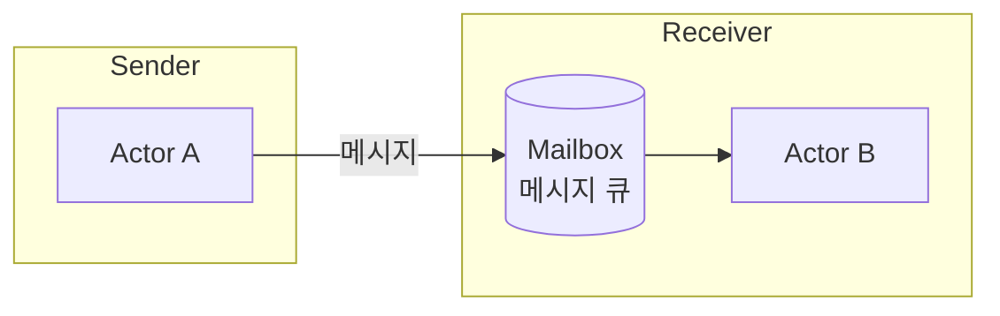
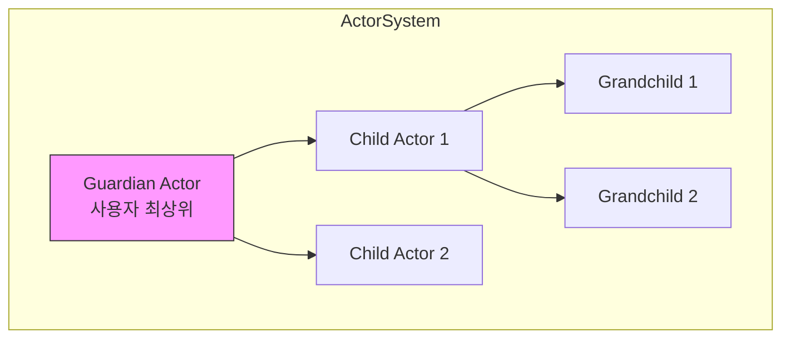
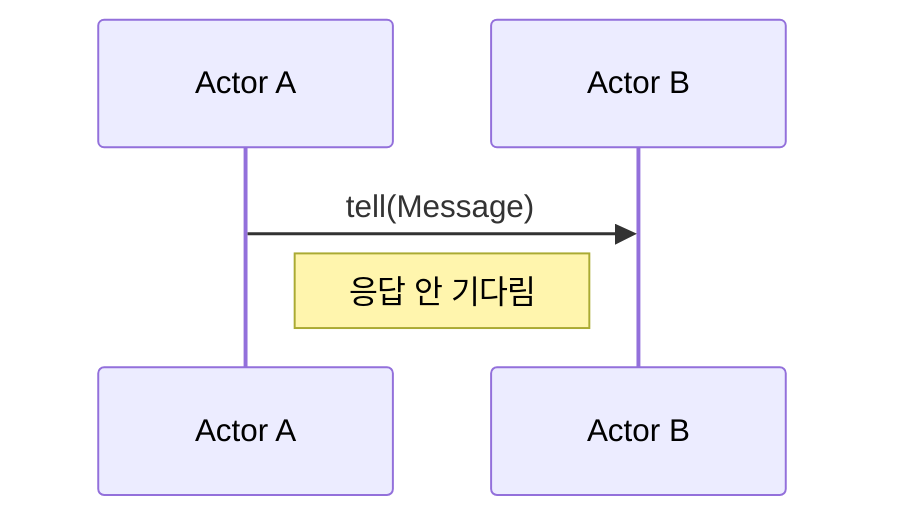
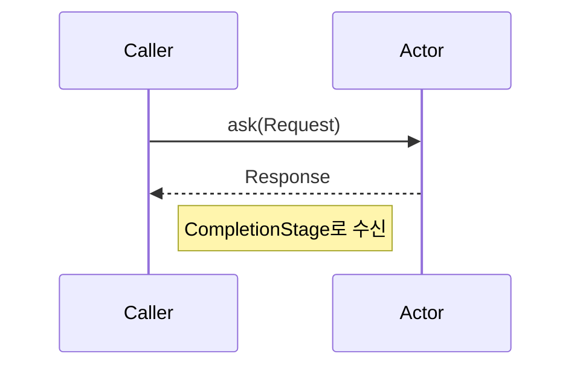
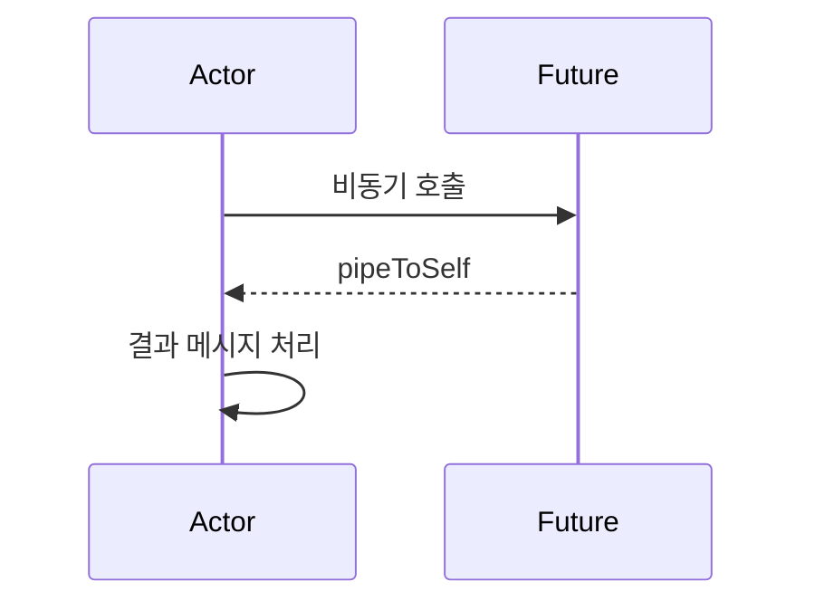
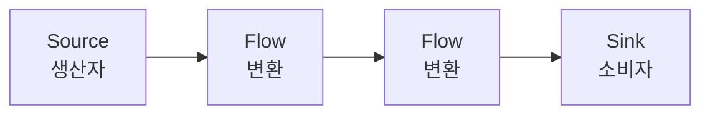
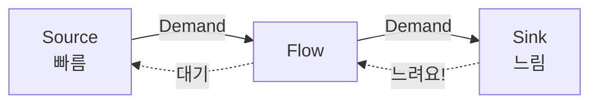
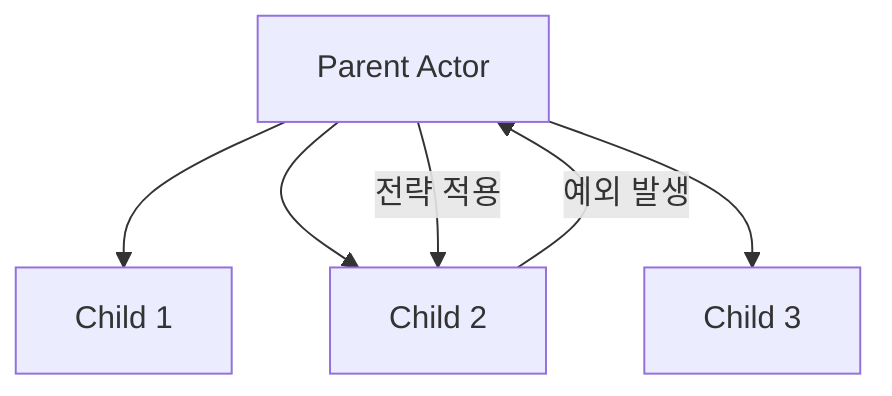

# Apache Pekko + Kotlin 학습 가이드

> 이 문서는 Actor Model의 핵심 개념과 Pekko 패턴을 다룹니다.
> 프로젝트 구조와 실행 방법은 [README.md](./README.md)를 참고하세요.

---

## Pekko란?

**Apache Pekko**는 Akka 2.6.x의 오픈소스 포크입니다. 2022년 Lightbend가 Akka의 라이선스를 BSL로 변경하면서, Apache 재단 아래에서 커뮤니티 주도로 탄생했습니다.

### 핵심 특징

| 특징 | 설명 |
|------|------|
| **Actor Model** | 동시성을 메시지 패싱으로 처리 |
| **분산 시스템** | 클러스터링, 리모팅 지원 |
| **Reactive Streams** | 백프레셔를 지원하는 비동기 스트림 |
| **Fault Tolerance** | Supervisor 전략으로 장애 복구 |
| **Apache 2.0 라이선스** | 상업적 사용 무료 |

---

## Actor Model 기초

### Actor란?

Actor는 동시성 프로그래밍의 기본 단위입니다. 각 Actor는:

- **자신만의 상태**를 가짐 (외부에서 직접 접근 불가)
- **메시지**를 통해서만 통신
- **한 번에 하나의 메시지**만 처리 (Thread-safe)
- **다른 Actor를 생성**할 수 있음



### Actor 계층 구조



부모 Actor는 자식의 **Supervisor**가 되어 장애를 처리합니다.

---

## Actor 구현 스타일

### 1. 클래스 기반 (AbstractBehavior)

상태가 많거나 복잡한 로직에 적합합니다.

```kotlin
class CounterActor(
    context: ActorContext<Command>
) : AbstractBehavior<Command>(context) {

    private var count = 0  // 내부 상태

    override fun createReceive(): Receive<Command> {
        return newReceiveBuilder()
            .onMessage(Increment::class.java) { onIncrement() }
            .onMessage(GetValue::class.java) { onGetValue(it) }
            .build()
    }

    private fun onIncrement(): Behavior<Command> {
        count++
        context.log.info("Count: $count")
        return this
    }

    private fun onGetValue(cmd: GetValue): Behavior<Command> {
        cmd.replyTo.tell(Value(count))
        return this
    }
}
```

### 2. 함수형 (Behaviors.receive)

상태 변경이 명확하고 간결한 코드가 필요할 때 적합합니다.

```kotlin
object FunctionalCounter {
    fun create(): Behavior<Command> = counter(0)

    private fun counter(count: Int): Behavior<Command> {
        return Behaviors.receive { context, message ->
            when (message) {
                is Increment -> counter(count + 1)  // 새 상태로 재귀
                is Decrement -> counter(count - 1)
                is GetValue -> {
                    message.replyTo.tell(Value(count))
                    Behaviors.same()
                }
            }
        }
    }
}
```

### 비교

| 스타일 | 장점 | 단점 |
|--------|------|------|
| 클래스 기반 | 복잡한 상태 관리, IDE 지원 | 보일러플레이트 |
| 함수형 | 간결함, 불변성 강조 | 깊은 상태에서 복잡 |

---

## 메시지 패턴

### Tell (Fire-and-Forget)

응답을 기다리지 않고 메시지를 보냅니다.

```kotlin
actorRef.tell(DoSomething("data"))
```



### Ask (요청-응답)

메시지를 보내고 `CompletionStage`로 응답을 받습니다.

```kotlin
val future: CompletionStage<Response> = AskPattern.ask(
    actorRef,
    { replyTo -> GetData(replyTo) },
    Duration.ofSeconds(3),
    system.scheduler()
)

future.thenAccept { response ->
    println("받은 응답: $response")
}
```



### Pipe

비동기 작업 결과를 Actor 자신에게 전달합니다.

```kotlin
context.pipeToSelf(externalAsyncCall()) { result, error ->
    if (error != null) OperationFailed(error)
    else OperationSuccess(result)
}
```



---

## Pekko Streams

백프레셔를 자동 처리하는 비동기 스트림 라이브러리입니다.

### 기본 개념



| 컴포넌트 | 역할 |
|----------|------|
| **Source** | 데이터 생산 (0..N 요소) |
| **Flow** | 데이터 변환 (1:1 또는 1:N) |
| **Sink** | 데이터 소비 (최종 처리) |

### 예제

```kotlin
Source.range(1, 100)
    .map { it * 2 }                    // 변환
    .filter { it > 50 }                // 필터링
    .mapAsync(4) { asyncProcess(it) }  // 병렬 비동기 처리
    .runWith(Sink.foreach { println(it) }, system)
```

### 백프레셔



소비자가 처리할 수 있는 만큼만 생산자가 데이터를 전송합니다.

---

## Supervisor 전략

자식 Actor 장애 시 부모가 어떻게 대응할지 결정합니다.



### 전략 종류

| 전략 | 설명 |
|------|------|
| `Restart` | 자식 재시작 (상태 초기화) |
| `Resume` | 예외 무시하고 계속 |
| `Stop` | 자식 중지 |
| `Escalate` | 부모에게 위임 |

### 설정 예제

```kotlin
Behaviors.supervise(childBehavior)
    .onFailure(IllegalStateException::class.java, SupervisorStrategy.restart())
```

---

## 설정 (application.conf)

```hocon
pekko {
  loglevel = "INFO"

  actor {
    # 기본 디스패처 설정
    default-dispatcher {
      throughput = 10
    }

    # 직렬화 설정 (클러스터링 시 필요)
    serialization-bindings {
      "com.example.CborSerializable" = jackson-cbor
    }
  }
}
```

### 주요 설정 항목

| 설정                       | 설명                               |
|--------------------------|----------------------------------|
| `loglevel`               | 로깅 레벨 (DEBUG, INFO, WARN, ERROR) |
| `throughput`             | 디스패처가 한 번에 처리할 메시지 수             |
| `serialization-bindings` | 직렬화 바인딩 (클러스터/리모트용)              |

---

## 테스트 (Kotest + TestKit)

이 프로젝트는 **Kotest** 테스트 프레임워크를 사용합니다.

```kotlin
class CounterActorTest : FunSpec({

    val testKit = ActorTestKit.create()

    afterSpec {
        testKit.shutdownTestKit()
    }

    test("Increment 후 값이 증가해야 한다") {
        val counter = testKit.spawn(CounterActor.create())
        val probe = testKit.createTestProbe<CounterActor.Value>()

        counter.tell(CounterActor.Increment)
        counter.tell(CounterActor.Increment)
        counter.tell(CounterActor.GetValue(probe.ref()))

        val response = probe.receiveMessage()
        response.count shouldBe 2
    }
})
```

### Kotest 스타일

| 스타일                       | 설명                       |
|---------------------------|--------------------------|
| `FunSpec`                 | 간단한 `test("...") { }` 블록 |
| `shouldBe`                | Kotest 매처로 값 검증          |
| `shouldBeInstanceOf<T>()` | 타입 검증 및 스마트 캐스트          |

### TestProbe

| 메서드                         | 설명        |
|-----------------------------|-----------|
| `receiveMessage()`          | 메시지 수신 대기 |
| `expectMessage(msg)`        | 특정 메시지 기대 |
| `expectNoMessage(duration)` | 메시지 없음 확인 |

---

## Akka에서 마이그레이션

| Akka                       | Pekko                          |
|----------------------------|--------------------------------|
| `akka.actor.typed`         | `org.apache.pekko.actor.typed` |
| `com.typesafe.akka:akka-*` | `org.apache.pekko:pekko-*`     |
| `akka { }` (설정)            | `pekko { }`                    |

패키지명과 설정 키만 변경하면 대부분 호환됩니다.

---

## 참고 자료

- [Apache Pekko 공식 사이트](https://pekko.apache.org/)
- [Pekko GitHub](https://github.com/apache/pekko)
- [Pekko 문서](https://pekko.apache.org/docs/pekko/current/)
- [Reactive Manifesto](https://www.reactivemanifesto.org/ko)

---

## 모듈별 상세 문서

각 기능의 심화 내용은 모듈별 README를 참고하세요:

- [cluster/README.md](./cluster/README.md) - 클러스터링, Split Brain Resolver
- [persistence/README.md](./persistence/README.md) - 이벤트 소싱, 스냅샷
- [http/README.md](./http/README.md) - REST API, Routing DSL
- [grpc/README.md](./grpc/README.md) - gRPC, Protocol Buffers
- [spring-boot/README.md](./spring-boot/README.md) - Spring Boot 통합
