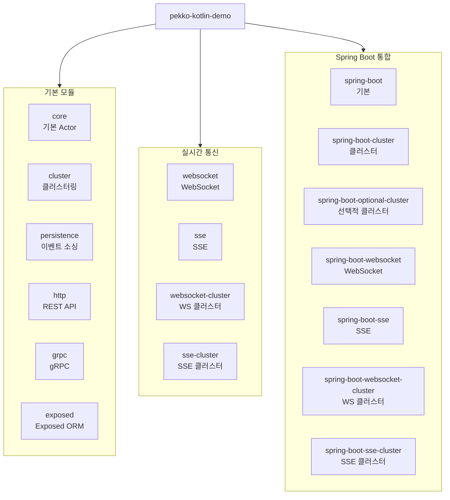

# Pekko Kotlin Demo

[](https://kotlinlang.org/)
[](https://pekko.apache.org/)
[](https://openjdk.org/)
[](LICENSE)

[Apache Pekko](https://pekko.apache.org/) Actor Model을 Kotlin으로 학습하기 위한 데모 프로젝트입니다.

## 빠른 시작

```bash
# 전체 빌드
./gradlew build

# core 모듈 실행 (기본 Actor 예제)
./gradlew :core:run
```

## 모듈 구조



### 기본 모듈

| 모듈                                | 설명                       | 실행 명령어                       |
|-----------------------------------|--------------------------|------------------------------|
| [**core**](./core/)               | Actor 기본, Streams, Ask 패턴 | `./gradlew :core:run`        |
| [**cluster**](./cluster/)         | 클러스터링, 싱글톤                | `./gradlew :cluster:run`     |
| [**persistence**](./persistence/) | 이벤트 소싱, 상태 복구             | `./gradlew :persistence:run` |
| [**http**](./http/)               | REST API 서버 (port 8080)   | `./gradlew :http:run`        |
| [**grpc**](./grpc/)               | gRPC 서버 (port 50051)      | `./gradlew :grpc:run`        |
| [**exposed**](./exposed/)         | Exposed ORM + Actor 통합    | `./gradlew :exposed:run`     |

### 실시간 통신 모듈 (Pure Pekko)

| 모듈                                        | 설명                      | 실행 명령어                           |
|-------------------------------------------|-------------------------|----------------------------------|
| [**websocket**](./websocket/)             | WebSocket 채팅 (port 8080) | `./gradlew :websocket:run`       |
| [**sse**](./sse/)                         | SSE 이벤트 스트림 (port 8081)  | `./gradlew :sse:run`             |
| [**websocket-cluster**](./websocket-cluster/) | WebSocket 클러스터          | `./gradlew :websocket-cluster:run` |
| [**sse-cluster**](./sse-cluster/)         | SSE 클러스터                 | `./gradlew :sse-cluster:run`     |

### Spring Boot 통합 모듈

| 모듈                                                            | 설명                     | 실행 명령어                                       |
|---------------------------------------------------------------|------------------------|----------------------------------------------|
| [**spring-boot**](./spring-boot/)                             | Spring Boot 기본 (port 8081) | `./gradlew :spring-boot:bootRun`             |
| [**spring-boot-cluster**](./spring-boot-cluster/)             | Spring Boot + 클러스터     | `./gradlew :spring-boot-cluster:bootRun`     |
| [**spring-boot-optional-cluster**](./spring-boot-optional-cluster/) | 선택적 클러스터 모드            | `./gradlew :spring-boot-optional-cluster:bootRun` |
| [**spring-boot-websocket**](./spring-boot-websocket/)         | WebSocket (port 8082)  | `./gradlew :spring-boot-websocket:bootRun`   |
| [**spring-boot-sse**](./spring-boot-sse/)                     | SSE (port 8083)        | `./gradlew :spring-boot-sse:bootRun`         |
| [**spring-boot-websocket-cluster**](./spring-boot-websocket-cluster/) | WebSocket 클러스터         | `./gradlew :spring-boot-websocket-cluster:bootRun` |
| [**spring-boot-sse-cluster**](./spring-boot-sse-cluster/)     | SSE 클러스터               | `./gradlew :spring-boot-sse-cluster:bootRun` |

> 각 모듈의 README.md에서 상세 문서를 확인할 수 있습니다.

## 기술 스택

| 기술           | 버전    | 비고               |
|--------------|-------|------------------|
| Kotlin       | 2.3.0 |                  |
| Apache Pekko | 1.4.0 | Akka 2.6.x 포크    |
| Spring Boot  | 4.0.1 | spring-boot 모듈   |
| JDK          | 25    | Gradle Toolchain |
| Gradle       | 9.2.1 | 멀티모듈 구성          |
| Kotest       | 6.0.5      | 테스트 프레임워크        |
| Exposed      | 1.0.0-rc-4 | exposed 모듈       |

## 테스트

Kotest FunSpec 스타일로 작성된 테스트:

```bash
# 전체 테스트
./gradlew test

# 특정 모듈 테스트
./gradlew :core:test
```

각 모듈별 테스트 파일:
- `core`: CounterActorTest, HelloWorldActorTest
- `cluster`: SingletonCounterTest
- `persistence`: PersistentCounterTest
- `http`: TaskRegistryTest
- `grpc`: GreeterActorTest
- `spring-boot`: TaskActorTest
- `exposed`: TaskActorTest

## 학습 자료

- **[PEKKO_GUIDE.md](./PEKKO_GUIDE.md)** - Actor Model 개념, 패턴, 설정 등 심화 학습
- **[cluster/README.md](./cluster/README.md)** - 클러스터링 가이드
- **[persistence/README.md](./persistence/README.md)** - 이벤트 소싱 가이드
- **[http/README.md](./http/README.md)** - REST API 가이드
- **[grpc/README.md](./grpc/README.md)** - gRPC 가이드
- **[spring-boot/README.md](./spring-boot/README.md)** - Spring Boot 통합 가이드
- **[exposed/README.md](./exposed/README.md)** - Exposed ORM 가이드
- **[websocket/README.md](./websocket/README.md)** - WebSocket 가이드
- **[sse/README.md](./sse/README.md)** - SSE 가이드

## Windows 한글 인코딩

한글이나 박스 문자가 깨지는 경우, 이미 다음 설정이 적용되어 있습니다:

- `gradle.properties`: JVM 인코딩 UTF-8
- `logback.xml`: 콘솔 인코딩 UTF-8
- `build.gradle.kts`: 실행 시 UTF-8 강제

추가로 필요한 경우:
1. Windows Terminal + 유니코드 폰트 사용
2. 구형 CMD: `chcp 65001` 실행

## 참고 링크

- [Apache Pekko 공식](https://pekko.apache.org/)
- [Pekko 문서](https://pekko.apache.org/docs/pekko/current/)
- [Pekko GitHub](https://github.com/apache/pekko)

## 라이선스

MIT License
