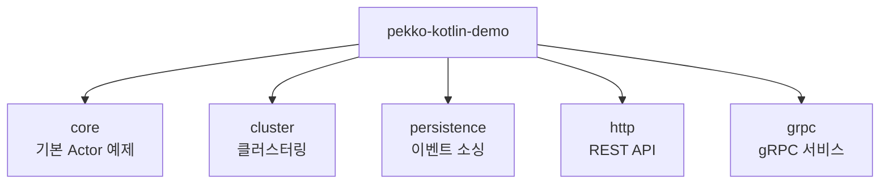

# Pekko Kotlin Demo

[](https://kotlinlang.org/)
[](https://pekko.apache.org/)
[](https://openjdk.org/)
[](LICENSE)

[Apache Pekko](https://pekko.apache.org/) Actor Model을 Kotlin으로 학습하기 위한 데모 프로젝트입니다.

## 빠른 시작

```bash
# 전체 빌드
./gradlew build

# core 모듈 실행 (기본 Actor 예제)
./gradlew :core:run
```

## 모듈 구조



| 모듈 | 설명 | 실행 명령어 |
|------|------|-------------|
| [**core**](./core/) | Actor 기본, Streams, Ask 패턴 | `./gradlew :core:run` |
| [**cluster**](./cluster/) | 클러스터링, 싱글톤 | `./gradlew :cluster:run` |
| [**persistence**](./persistence/) | 이벤트 소싱, 상태 복구 | `./gradlew :persistence:run` |
| [**http**](./http/) | REST API 서버 (port 8080) | `./gradlew :http:run` |
| [**grpc**](./grpc/) | gRPC 서버 (port 50051) | `./gradlew :grpc:run` |

> 각 모듈의 README.md에서 상세 문서를 확인할 수 있습니다.

## 기술 스택

| 기술 | 버전 | 비고 |
|------|------|------|
| Kotlin | 2.3.0 | |
| Apache Pekko | 1.3.0 | Akka 2.6.x 포크 |
| JDK | 25 | Gradle Toolchain 자동 다운로드 |
| Gradle | 9.x | 멀티모듈 구성 |

## 테스트

```bash
# 전체 테스트
./gradlew test

# 특정 모듈 테스트
./gradlew :core:test
```

## 학습 자료

- **[PEKKO_GUIDE.md](./PEKKO_GUIDE.md)** - Actor Model 개념, 패턴, 설정 등 심화 학습
- **[cluster/README.md](./cluster/README.md)** - 클러스터링 가이드
- **[persistence/README.md](./persistence/README.md)** - 이벤트 소싱 가이드
- **[http/README.md](./http/README.md)** - REST API 가이드
- **[grpc/README.md](./grpc/README.md)** - gRPC 가이드

## Windows 한글 인코딩

한글이나 박스 문자가 깨지는 경우, 이미 다음 설정이 적용되어 있습니다:

- `gradle.properties`: JVM 인코딩 UTF-8
- `logback.xml`: 콘솔 인코딩 UTF-8
- `build.gradle.kts`: 실행 시 UTF-8 강제

추가로 필요한 경우:
1. Windows Terminal + 유니코드 폰트 사용
2. 구형 CMD: `chcp 65001` 실행

## 참고 링크

- [Apache Pekko 공식](https://pekko.apache.org/)
- [Pekko 문서](https://pekko.apache.org/docs/pekko/current/)
- [Pekko GitHub](https://github.com/apache/pekko)

## 라이선스

MIT License
