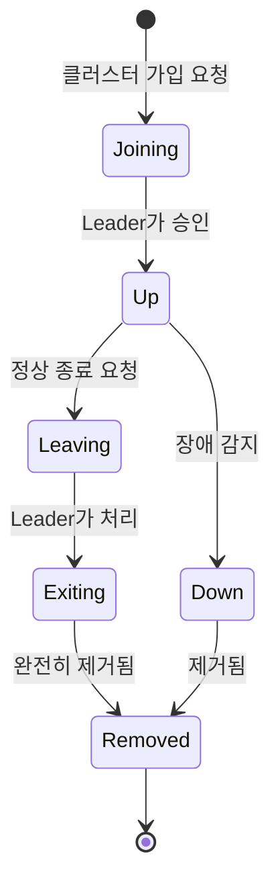
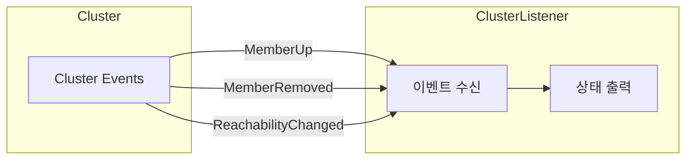
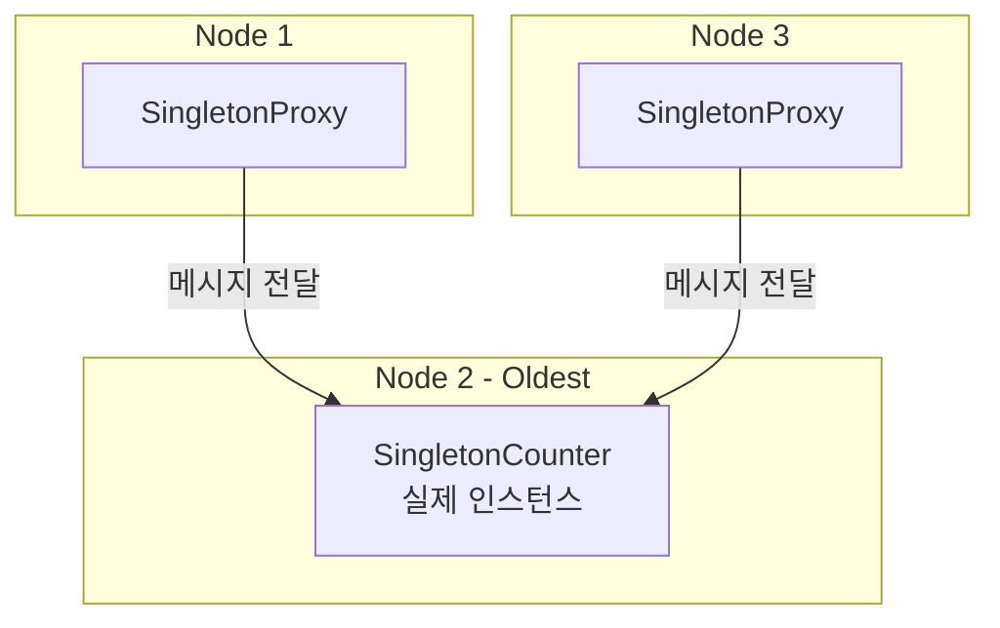
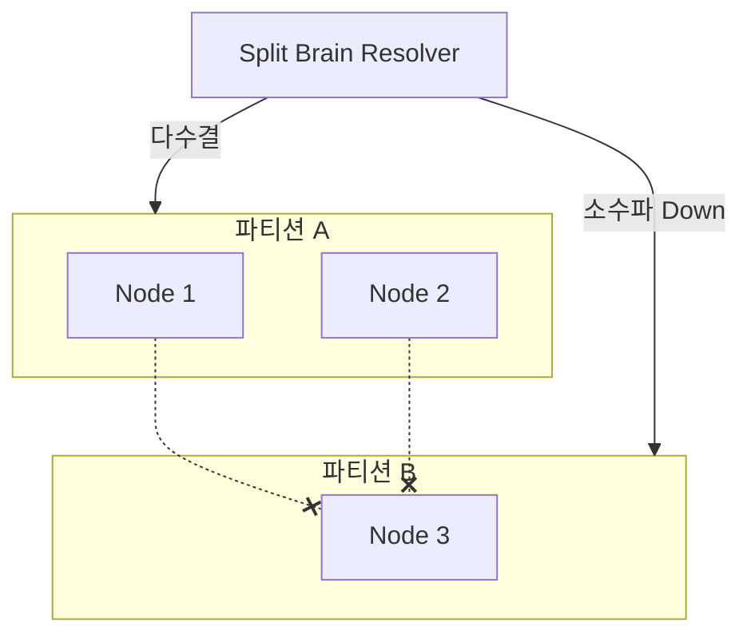

# Pekko Cluster 모듈

## 개요

이 모듈은 **Apache Pekko Cluster**를 사용하여 분산 Actor 시스템을 구축하는 방법을 보여줍니다.

## Pekko Cluster란?

Pekko Cluster는 여러 JVM 노드에서 Actor 시스템을 연결하여 분산 애플리케이션을 구축할 수 있게 해줍니다.

### 핵심 개념

| 개념            | 설명                           |
|---------------|------------------------------|
| **Node**      | 클러스터에 참여하는 개별 JVM 인스턴스       |
| **Member**    | 클러스터에 가입한 노드                 |
| **Leader**    | 클러스터 상태 변경을 조정하는 노드          |
| **Seed Node** | 새 노드가 클러스터에 가입할 때 연락하는 초기 노드 |

### 클러스터 상태 다이어그램



---

## 프로젝트 구조

```
cluster/
├── build.gradle.kts
└── src/main/
    ├── kotlin/com/example/pekko/cluster/
    │   ├── ClusterListener.kt      # 클러스터 이벤트 리스너
    │   ├── SingletonCounter.kt     # 클러스터 싱글톤 예제
    │   ├── CborSerializable.kt     # 직렬화 마커
    │   └── ClusterMain.kt          # 진입점
    └── resources/
        ├── application.conf        # 클러스터 설정
        └── logback.xml
```

---

## 주요 컴포넌트

### 1. ClusterListener

클러스터 이벤트(멤버 가입/탈퇴)를 구독하고 로깅합니다.



#### 주요 이벤트

| 이벤트                 | 설명                |
|---------------------|-------------------|
| `MemberUp`          | 새 멤버가 클러스터에 가입 완료 |
| `MemberRemoved`     | 멤버가 클러스터에서 제거됨    |
| `UnreachableMember` | 멤버에 연결할 수 없음      |
| `ReachableMember`   | 멤버가 다시 연결 가능해짐    |

#### 코드 예제

```kotlin
Cluster.get(context.system).subscriptions().tell(
    Subscribe(context.self, ClusterEvent.MemberEvent::class.java)
)
```

### 2. SingletonCounter

클러스터 전체에서 **단 하나의 인스턴스**만 존재하도록 보장하는 싱글톤 Actor입니다.



#### 사용 사례

- 전역 카운터/시퀀스 생성기
- 분산 락 관리자
- 외부 리소스 조정자

#### 코드 예제

```kotlin
// 싱글톤 생성
ClusterSingleton.get(system).init(
    SingletonActor.of(SingletonCounter.create(), "GlobalCounter")
)

// 프록시를 통한 접근
val proxy = ClusterSingleton.get(system).init(
    SingletonActor.of(SingletonCounter.create(), "GlobalCounter")
)
proxy.tell(SingletonCounter.Increment)
```

---

## 설정 (application.conf)

```hocon
pekko {
  actor {
    provider = "cluster"  # 클러스터 모드 활성화

    serialization-bindings {
      "com.example.pekko.cluster.CborSerializable" = jackson-cbor
    }
  }

  remote.artery {
    canonical.hostname = "127.0.0.1"
    canonical.port = 2551
  }

  cluster {
    seed-nodes = ["pekko://ClusterSystem@127.0.0.1:2551"]
    downing-provider-class = "org.apache.pekko.cluster.sbr.SplitBrainResolverProvider"
  }
}
```

### 주요 설정 항목

| 설정                               | 설명                            |
|----------------------------------|-------------------------------|
| `actor.provider`                 | `"cluster"`로 설정하여 클러스터 모드 활성화 |
| `remote.artery.canonical.port`   | 노드 간 통신에 사용할 포트               |
| `cluster.seed-nodes`             | 클러스터 부트스트랩을 위한 시드 노드 목록       |
| `cluster.downing-provider-class` | Split Brain 해결 전략             |

---

## 실행 방법

```bash
# 단일 노드 실행
./gradlew :cluster:run

# 여러 노드 실행 (다른 터미널에서)
./gradlew :cluster:run -Dpekko.remote.artery.canonical.port=2552
./gradlew :cluster:run -Dpekko.remote.artery.canonical.port=2553
```

---

## Split Brain Resolver (SBR)

네트워크 파티션 발생 시 클러스터가 분할되는 것을 방지합니다.



### SBR 전략

| 전략              | 설명                     |
|-----------------|------------------------|
| `keep-majority` | 다수 파티션 유지, 소수 파티션 down |
| `keep-oldest`   | 가장 오래된 노드가 있는 파티션 유지   |
| `keep-referee`  | 지정된 레퍼리 노드가 있는 파티션 유지  |
| `down-all`      | 모든 노드 down (안전 모드)     |

---

## 의존성

```kotlin
dependencies {
    implementation("org.apache.pekko:pekko-actor-typed_2.13")
    implementation("org.apache.pekko:pekko-cluster-typed_2.13")
    implementation("org.apache.pekko:pekko-serialization-jackson_2.13")
}
```

---

## 테스트

Kotest FunSpec 스타일로 작성된 테스트:

```bash
./gradlew :cluster:test
```

### 테스트 예제 (Kotest)

```kotlin
class SingletonCounterTest : FunSpec({

    val testKit = ActorTestKit.create()

    afterSpec {
        testKit.shutdownTestKit()
    }

    test("SingletonCounter는 초기값이 0이어야 한다") {
        val counter = testKit.spawn(SingletonCounter.create())
        val probe = testKit.createTestProbe<SingletonCounter.Value>()

        counter.tell(SingletonCounter.GetValue(probe.ref()))

        val response = probe.receiveMessage()
        response.count shouldBe 0
    }
})
```

테스트 파일:
- `SingletonCounterTest.kt`

---

## 참고 자료

- [Pekko Cluster 문서](https://pekko.apache.org/docs/pekko/current/typed/cluster.html)
- [Cluster Singleton 문서](https://pekko.apache.org/docs/pekko/current/typed/cluster-singleton.html)
- [Split Brain Resolver 문서](https://pekko.apache.org/docs/pekko/current/split-brain-resolver.html)
