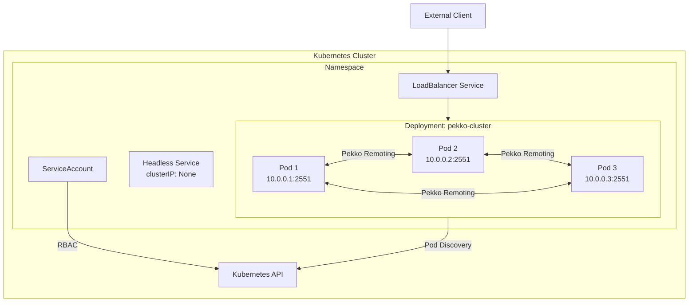

# Pekko Cluster 모듈

## 개요

이 모듈은 **Apache Pekko Cluster**를 사용하여 분산 Actor 시스템을 구축하는 방법을 보여줍니다.

## Pekko Cluster란?

Pekko Cluster는 여러 JVM 노드에서 Actor 시스템을 연결하여 분산 애플리케이션을 구축할 수 있게 해줍니다.

### 핵심 개념

| 개념            | 설명                           |
|---------------|------------------------------|
| **Node**      | 클러스터에 참여하는 개별 JVM 인스턴스       |
| **Member**    | 클러스터에 가입한 노드                 |
| **Leader**    | 클러스터 상태 변경을 조정하는 노드          |
| **Seed Node** | 새 노드가 클러스터에 가입할 때 연락하는 초기 노드 |

### 클러스터 상태 다이어그램


---

## 프로젝트 구조

```
cluster/
├── build.gradle.kts
└── src/main/
    ├── kotlin/com/example/pekko/cluster/
    │   ├── ClusterListener.kt      # 클러스터 이벤트 리스너
    │   ├── SingletonCounter.kt     # 클러스터 싱글톤 예제
    │   ├── CborSerializable.kt     # 직렬화 마커
    │   └── ClusterMain.kt          # 진입점
    └── resources/
        ├── application.conf        # 클러스터 설정
        └── logback.xml
```

---

## 주요 컴포넌트

### 1. ClusterListener

클러스터 이벤트(멤버 가입/탈퇴)를 구독하고 로깅합니다.


#### 주요 이벤트

| 이벤트                 | 설명                |
|---------------------|-------------------|
| `MemberUp`          | 새 멤버가 클러스터에 가입 완료 |
| `MemberRemoved`     | 멤버가 클러스터에서 제거됨    |
| `UnreachableMember` | 멤버에 연결할 수 없음      |
| `ReachableMember`   | 멤버가 다시 연결 가능해짐    |

#### 코드 예제

```kotlin
Cluster.get(context.system).subscriptions().tell(
    Subscribe(context.self, ClusterEvent.MemberEvent::class.java)
)
```

### 2. SingletonCounter

클러스터 전체에서 **단 하나의 인스턴스**만 존재하도록 보장하는 싱글톤 Actor입니다.


#### 사용 사례

- 전역 카운터/시퀀스 생성기
- 분산 락 관리자
- 외부 리소스 조정자

#### 코드 예제

```kotlin
// 싱글톤 생성
ClusterSingleton.get(system).init(
    SingletonActor.of(SingletonCounter.create(), "GlobalCounter")
)

// 프록시를 통한 접근
val proxy = ClusterSingleton.get(system).init(
    SingletonActor.of(SingletonCounter.create(), "GlobalCounter")
)
proxy.tell(SingletonCounter.Increment)
```

---

## 설정 (application.conf)

```hocon
pekko {
  actor {
    provider = "cluster"  # 클러스터 모드 활성화

    serialization-bindings {
      "com.example.pekko.cluster.CborSerializable" = jackson-cbor
    }
  }

  remote.artery {
    canonical.hostname = "127.0.0.1"
    canonical.port = 2551
  }

  cluster {
    seed-nodes = ["pekko://ClusterSystem@127.0.0.1:2551"]
    downing-provider-class = "org.apache.pekko.cluster.sbr.SplitBrainResolverProvider"
  }
}
```

### 주요 설정 항목

| 설정                               | 설명                            |
|----------------------------------|-------------------------------|
| `actor.provider`                 | `"cluster"`로 설정하여 클러스터 모드 활성화 |
| `remote.artery.canonical.port`   | 노드 간 통신에 사용할 포트               |
| `cluster.seed-nodes`             | 클러스터 부트스트랩을 위한 시드 노드 목록       |
| `cluster.downing-provider-class` | Split Brain 해결 전략             |

---

## 실행 방법

```bash
# 단일 노드 실행
./gradlew :cluster:run

# 여러 노드 실행 (다른 터미널에서)
./gradlew :cluster:run -Dpekko.remote.artery.canonical.port=2552
./gradlew :cluster:run -Dpekko.remote.artery.canonical.port=2553
```

---

## Split Brain Resolver (SBR)

네트워크 파티션 발생 시 클러스터가 분할되는 것을 방지합니다.


### SBR 전략

| 전략              | 설명                     |
|-----------------|------------------------|
| `keep-majority` | 다수 파티션 유지, 소수 파티션 down |
| `keep-oldest`   | 가장 오래된 노드가 있는 파티션 유지   |
| `keep-referee`  | 지정된 레퍼리 노드가 있는 파티션 유지  |
| `down-all`      | 모든 노드 down (안전 모드)     |

---

## Kubernetes 배포

Kubernetes 환경에서는 정적 seed-nodes 대신 **Pekko Cluster Bootstrap**을 사용하여 동적으로 클러스터를 구성합니다.

### 아키텍처



### 추가 의존성

```kotlin
dependencies {
    // 기존 의존성...
    implementation("org.apache.pekko:pekko-management_2.13:1.0.0")
    implementation("org.apache.pekko:pekko-management-cluster-bootstrap_2.13:1.0.0")
    implementation("org.apache.pekko:pekko-discovery-kubernetes-api_2.13:1.0.0")
}
```

### application.conf (Kubernetes용)

```hocon
pekko {
  actor {
    provider = cluster
    serialization-bindings {
      "com.example.pekko.cluster.CborSerializable" = jackson-cbor
    }
  }

  remote.artery {
    canonical {
      hostname = ${?POD_IP}
      port = 2551
    }
  }

  cluster {
    # seed-nodes 제거 - Bootstrap이 자동 처리
    downing-provider-class = "org.apache.pekko.cluster.sbr.SplitBrainResolverProvider"
    split-brain-resolver {
      active-strategy = "keep-majority"
      stable-after = 20s
    }
  }

  management {
    http {
      hostname = ${?POD_IP}
      port = 8558
      bind-hostname = "0.0.0.0"
    }
    cluster.bootstrap {
      contact-point-discovery {
        discovery-method = kubernetes-api
        service-name = "pekko-cluster"
        required-contact-point-nr = 2
      }
    }
  }

  discovery {
    method = kubernetes-api
    kubernetes-api {
      pod-namespace = ${?POD_NAMESPACE}
      pod-label-selector = "app=pekko-cluster"
    }
  }
}
```

### Kubernetes 매니페스트

#### Deployment

```yaml
apiVersion: apps/v1
kind: Deployment
metadata:
  name: pekko-cluster
spec:
  replicas: 3
  selector:
    matchLabels:
      app: pekko-cluster
  template:
    metadata:
      labels:
        app: pekko-cluster
    spec:
      serviceAccountName: pekko-cluster
      containers:
        - name: pekko-cluster
          image: your-registry/pekko-cluster:latest
          ports:
            - name: remoting
              containerPort: 2551
            - name: management
              containerPort: 8558
          env:
            - name: POD_IP
              valueFrom:
                fieldRef:
                  fieldPath: status.podIP
            - name: POD_NAMESPACE
              valueFrom:
                fieldRef:
                  fieldPath: metadata.namespace
          readinessProbe:
            httpGet:
              path: /ready
              port: management
            initialDelaySeconds: 10
          livenessProbe:
            httpGet:
              path: /alive
              port: management
            initialDelaySeconds: 20
```

#### Headless Service

```yaml
apiVersion: v1
kind: Service
metadata:
  name: pekko-cluster
spec:
  clusterIP: None  # Headless
  selector:
    app: pekko-cluster
  ports:
    - name: remoting
      port: 2551
    - name: management
      port: 8558
```

#### RBAC

```yaml
apiVersion: v1
kind: ServiceAccount
metadata:
  name: pekko-cluster
---
apiVersion: rbac.authorization.k8s.io/v1
kind: Role
metadata:
  name: pekko-cluster-role
rules:
  - apiGroups: [""]
    resources: ["pods"]
    verbs: ["get", "watch", "list"]
---
apiVersion: rbac.authorization.k8s.io/v1
kind: RoleBinding
metadata:
  name: pekko-cluster-binding
subjects:
  - kind: ServiceAccount
    name: pekko-cluster
roleRef:
  kind: Role
  name: pekko-cluster-role
  apiGroup: rbac.authorization.k8s.io
```

### 애플리케이션 코드 수정

```kotlin
fun main() {
    val system = ActorSystem.create(rootBehavior(), "ClusterSystem")

    // Cluster Bootstrap 시작
    PekkoManagement.get(system).start()
    ClusterBootstrap.get(system).start()
}
```

### 주요 개념

| 개념                    | 설명                                        |
|-----------------------|-------------------------------------------|
| **Cluster Bootstrap** | Kubernetes API로 Pod를 발견하여 자동 클러스터 형성      |
| **Headless Service**  | `clusterIP: None`으로 Pod 직접 DNS 레코드 생성     |
| **Pekko Management**  | 헬스체크 엔드포인트 제공 (`/ready`, `/alive`)        |
| **RBAC**              | Pod 목록 조회 권한 필요 (`get`, `list`, `watch`) |

### 배포 명령어

```bash
# 리소스 배포
kubectl apply -f k8s/

# 클러스터 상태 확인
kubectl logs -l app=pekko-cluster --tail=100

# 스케일링
kubectl scale deployment pekko-cluster --replicas=5
```

---

## 의존성

```kotlin
dependencies {
    implementation("org.apache.pekko:pekko-actor-typed_2.13")
    implementation("org.apache.pekko:pekko-cluster-typed_2.13")
    implementation("org.apache.pekko:pekko-serialization-jackson_2.13")
}
```

---

## 테스트

Kotest FunSpec 스타일로 작성된 테스트:

```bash
./gradlew :cluster:test
```

### 테스트 예제 (Kotest)

```kotlin
class SingletonCounterTest : FunSpec({

    val testKit = ActorTestKit.create()

    afterSpec {
        testKit.shutdownTestKit()
    }

    test("SingletonCounter는 초기값이 0이어야 한다") {
        val counter = testKit.spawn(SingletonCounter.create())
        val probe = testKit.createTestProbe<SingletonCounter.Value>()

        counter.tell(SingletonCounter.GetValue(probe.ref()))

        val response = probe.receiveMessage()
        response.count shouldBe 0
    }
})
```

테스트 파일:
- `SingletonCounterTest.kt`

---

## 참고 자료

- [Pekko Cluster 문서](https://pekko.apache.org/docs/pekko/current/typed/cluster.html)
- [Cluster Singleton 문서](https://pekko.apache.org/docs/pekko/current/typed/cluster-singleton.html)
- [Split Brain Resolver 문서](https://pekko.apache.org/docs/pekko/current/split-brain-resolver.html)
