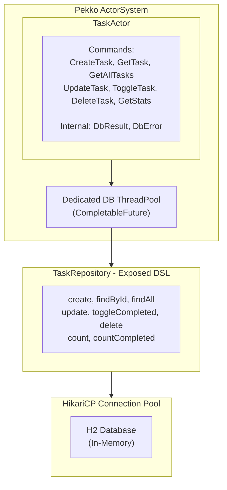

# Exposed Module (Pekko + JetBrains Exposed)

This module demonstrates integration between Apache Pekko Actors and JetBrains Exposed ORM.

## Features

- **JetBrains Exposed ORM**: Type-safe SQL with Kotlin DSL
- **Pekko Actor Integration**: Actor-based database operations
- **Connection Pooling**: HikariCP for efficient connection management
- **Async Operations**: Non-blocking database access using dedicated thread pool
- **H2 Database**: Embedded in-memory database for demo

## Architecture



## Running

```bash
./gradlew :exposed:run
```

## Output

```
Database initialized with H2 in-memory database

=== Pekko + Exposed Demo ===

Creating tasks...
Created: TaskFound(task=Task(id=1, title=Learn Pekko, description=Study Pekko actor model, ...))
Created: TaskFound(task=Task(id=2, title=Learn Exposed, description=Study JetBrains Exposed ORM, ...))
Created: TaskFound(task=Task(id=3, title=Build demo app, description=null, ...))

--- All Tasks ---
  - 1: Learn Pekko [ ]
  - 2: Learn Exposed [ ]
  - 3: Build demo app [ ]

--- Toggle Task 1 ---
Toggled: TaskFound(task=Task(id=1, ..., completed=true, ...))

--- Update Task 2 ---
Updated: TaskFound(task=Task(id=2, title=Master Exposed, description=Become an Exposed ORM expert, ...))

--- Statistics ---
Total tasks: 3, Completed: 1

...

=== Demo Complete ===
System shutdown complete
```

## Testing

```bash
./gradlew :exposed:test
```

## Key Concepts

### Blocking Database Operations with Pekko

Pekko actors should not block. This module demonstrates how to handle blocking database operations:

1. **Dedicated Thread Pool**: A separate `ExecutorService` handles DB operations
2. **CompletableFuture**: Async execution with callback
3. **Pipe to Self**: Results are sent back to actor via internal messages

```kotlin
private fun <T> runAsync(replyTo: ActorRef<T>, block: () -> T) {
    val self = context.self
    CompletableFuture.supplyAsync(block, dbExecutor)
        .whenComplete { result, error ->
            if (error != null) {
                self.tell(DbError(error, replyTo))
            } else {
                self.tell(DbResult(result, replyTo))
            }
        }
}
```

### Exposed DSL

JetBrains Exposed provides type-safe SQL:

```kotlin
// Table definition
object Tasks : LongIdTable("tasks") {
    val title = varchar("title", 255)
    val description = text("description").nullable()
    val completed = bool("completed").default(false)
    val createdAt = timestamp("created_at")
}

// Query example
fun findById(id: Long): Task? = transaction(database) {
    Tasks.selectAll()
        .where { Tasks.id eq id }
        .map { it.toTask() }
        .singleOrNull()
}
```

## Dependencies

| Library                 | Version     | Purpose                    |
|-------------------------|-------------|----------------------------|
| exposed-core            | 1.0.0-rc-4  | Exposed core functionality |
| exposed-dao             | 1.0.0-rc-4  | DAO pattern support        |
| exposed-jdbc            | 1.0.0-rc-4  | JDBC integration           |
| exposed-kotlin-datetime | 1.0.0-rc-4  | Kotlin datetime support    |
| H2                      | 2.2.224     | In-memory database         |
| HikariCP                | 5.1.0       | Connection pooling         |

## Comparison with Other Approaches

| Feature             | Exposed DSL     | JPA/Hibernate   | Raw JDBC        |
|---------------------|-----------------|-----------------|-----------------|
| Type Safety         | Compile-time    | Runtime         | None            |
| Kotlin Integration  | Native          | Java-based      | Manual          |
| Learning Curve      | Low             | Medium          | Low             |
| Performance         | Good            | Good            | Best            |
| Boilerplate         | Minimal         | Medium          | High            |
