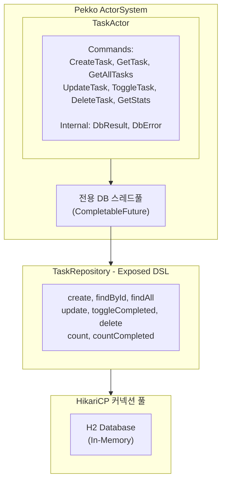

# Exposed 모듈 (Pekko + JetBrains Exposed)

이 모듈은 Apache Pekko Actor와 JetBrains Exposed ORM의 통합을 보여줍니다.

## 기능

- **JetBrains Exposed ORM**: Kotlin DSL을 사용한 타입 안전 SQL
- **Pekko Actor 통합**: Actor 기반 데이터베이스 작업
- **커넥션 풀링**: HikariCP를 사용한 효율적인 커넥션 관리
- **비동기 작업**: 전용 스레드 풀을 사용한 논블로킹 데이터베이스 접근
- **H2 데이터베이스**: 데모용 임베디드 인메모리 데이터베이스

## 아키텍처



## 실행 방법

```bash
./gradlew :exposed:run
```

## 출력 예시

```
Database initialized with H2 in-memory database

=== Pekko + Exposed Demo ===

Creating tasks...
Created: TaskFound(task=Task(id=1, title=Learn Pekko, description=Study Pekko actor model, ...))
Created: TaskFound(task=Task(id=2, title=Learn Exposed, description=Study JetBrains Exposed ORM, ...))
Created: TaskFound(task=Task(id=3, title=Build demo app, description=null, ...))

--- All Tasks ---
  - 1: Learn Pekko [ ]
  - 2: Learn Exposed [ ]
  - 3: Build demo app [ ]

--- Toggle Task 1 ---
Toggled: TaskFound(task=Task(id=1, ..., completed=true, ...))

--- Update Task 2 ---
Updated: TaskFound(task=Task(id=2, title=Master Exposed, description=Become an Exposed ORM expert, ...))

--- Statistics ---
Total tasks: 3, Completed: 1

...

=== Demo Complete ===
System shutdown complete
```

## 테스트

```bash
./gradlew :exposed:test
```

## 주요 개념

### Pekko에서 블로킹 데이터베이스 작업 처리

Pekko Actor는 블로킹하면 안 됩니다. 이 모듈은 블로킹 데이터베이스 작업을 처리하는 방법을 보여줍니다:

1. **전용 스레드 풀**: 별도의 `ExecutorService`가 DB 작업을 처리
2. **CompletableFuture**: 콜백을 사용한 비동기 실행
3. **Pipe to Self**: 결과가 내부 메시지를 통해 Actor로 다시 전송

```kotlin
private fun <T> runAsync(replyTo: ActorRef<T>, block: () -> T) {
    val self = context.self
    CompletableFuture.supplyAsync(block, dbExecutor)
        .whenComplete { result, error ->
            if (error != null) {
                self.tell(DbError(error, replyTo))
            } else {
                self.tell(DbResult(result, replyTo))
            }
        }
}
```

### Exposed DSL

JetBrains Exposed는 타입 안전 SQL을 제공합니다:

```kotlin
// 테이블 정의
object Tasks : LongIdTable("tasks") {
    val title = varchar("title", 255)
    val description = text("description").nullable()
    val completed = bool("completed").default(false)
    val createdAt = timestamp("created_at")
}

// 쿼리 예제
fun findById(id: Long): Task? = transaction(database) {
    Tasks.selectAll()
        .where { Tasks.id eq id }
        .map { it.toTask() }
        .singleOrNull()
}
```

## 의존성

| 라이브러리                   | 버전         | 용도                 |
|-------------------------|------------|--------------------|
| exposed-core            | 1.0.0-rc-4 | Exposed 핵심 기능      |
| exposed-dao             | 1.0.0-rc-4 | DAO 패턴 지원          |
| exposed-jdbc            | 1.0.0-rc-4 | JDBC 통합            |
| exposed-kotlin-datetime | 1.0.0-rc-4 | Kotlin datetime 지원 |
| H2                      | 2.2.224    | 인메모리 데이터베이스        |
| HikariCP                | 5.1.0      | 커넥션 풀링             |

## 다른 접근 방식과의 비교

| 기능          | Exposed DSL | JPA/Hibernate | Raw JDBC |
|-------------|-------------|---------------|----------|
| 타입 안전성      | 컴파일 타임      | 런타임           | 없음       |
| Kotlin 통합   | 네이티브        | Java 기반       | 수동       |
| 학습 곡선       | 낮음          | 중간            | 낮음       |
| 성능          | 좋음          | 좋음            | 최고       |
| 보일러플레이트     | 최소          | 중간            | 많음       |
