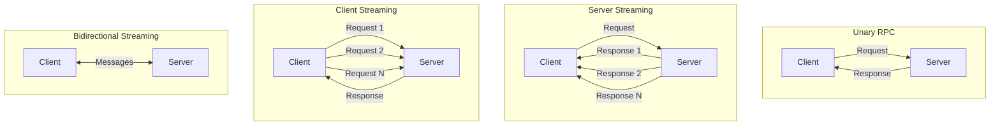
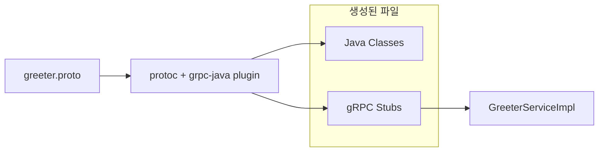
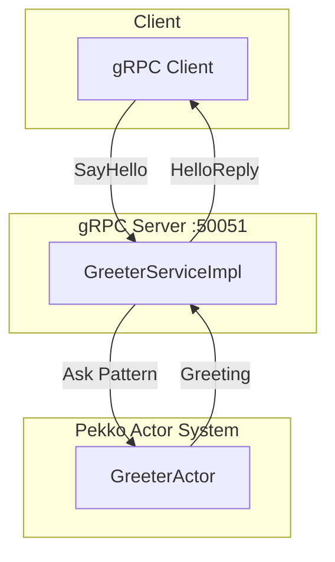
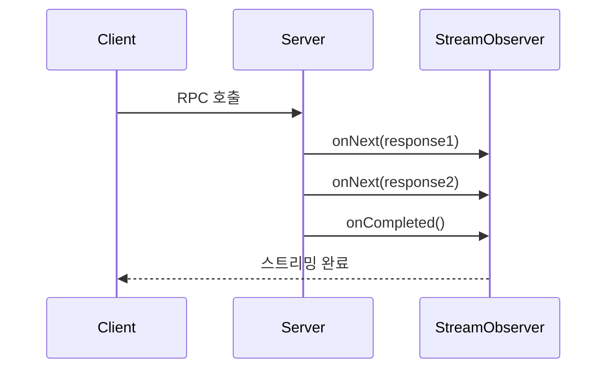

# Pekko gRPC 모듈

## 개요

이 모듈은 **gRPC**와 **Pekko Actor**를 결합하여 고성능 RPC 서비스를 구축하는 방법을 보여줍니다.

## gRPC란?

gRPC는 Google이 개발한 고성능 RPC(Remote Procedure Call) 프레임워크입니다.

### gRPC vs REST

| 특성       | gRPC                       | REST        |
|----------|----------------------------|-------------|
| **프로토콜**  | HTTP/2                     | HTTP/1.1    |
| **데이터 형식** | Protocol Buffers (바이너리)    | JSON (텍스트)  |
| **스트리밍**  | 양방향 지원                     | 제한적         |
| **코드 생성** | 자동 (protoc)                | 수동          |
| **성능**    | 높음                         | 보통          |

### RPC 유형



---

## 프로젝트 구조

```
grpc/
├── build.gradle.kts
└── src/main/
    ├── proto/
    │   └── greeter.proto           # 서비스 정의
    ├── kotlin/com/example/pekko/grpc/
    │   ├── GrpcMain.kt             # 진입점
    │   ├── GreeterActor.kt         # 비즈니스 로직 Actor
    │   └── GreeterServiceImpl.kt   # gRPC 서비스 구현
    └── resources/
        └── logback.xml
```

---

## Protocol Buffers 정의

### greeter.proto

```protobuf
syntax = "proto3";

package com.example.pekko.grpc;

option java_multiple_files = true;
option java_package = "com.example.pekko.grpc.proto";

// 서비스 정의
service GreeterService {
    // Unary RPC
    rpc SayHello (HelloRequest) returns (HelloReply);

    // Server Streaming RPC
    rpc SayHelloStream (HelloRequest) returns (stream HelloReply);
}

message HelloRequest {
    string name = 1;
}

message HelloReply {
    string message = 1;
    int64 timestamp = 2;
}
```

### 코드 생성



Gradle이 빌드 시 자동으로 생성합니다:
- `HelloRequest.java` - 요청 메시지
- `HelloReply.java` - 응답 메시지
- `GreeterServiceGrpc.java` - 서비스 스텁

---

## 아키텍처



---

## 주요 컴포넌트

### 1. GreeterActor

인사 메시지를 생성하는 Actor입니다.

```kotlin
object GreeterActor {
    sealed interface Command
    data class Greet(val name: String, val replyTo: ActorRef<Greeting>) : Command
    data class GreetMultiple(val name: String, val count: Int, val replyTo: ActorRef<MultipleGreetings>) : Command

    data class Greeting(val message: String, val timestamp: Long)
    data class MultipleGreetings(val greetings: List<Greeting>)

    fun create(): Behavior<Command> = Behaviors.setup { context ->
        // Actor 구현
    }
}
```

### 2. GreeterServiceImpl

gRPC 서비스 인터페이스를 구현합니다.

```kotlin
class GreeterServiceImpl(
    private val system: ActorSystem<*>,
    private val greeterActor: ActorRef<GreeterActor.Command>
) : GreeterServiceGrpc.GreeterServiceImplBase() {

    // Unary RPC
    override fun sayHello(
        request: HelloRequest,
        responseObserver: StreamObserver<HelloReply>
    ) {
        val future = AskPattern.ask(
            greeterActor,
            { replyTo -> GreeterActor.Greet(request.name, replyTo) },
            timeout,
            system.scheduler()
        )

        future.whenComplete { greeting, error ->
            if (error != null) {
                responseObserver.onError(error)
            } else {
                val reply = HelloReply.newBuilder()
                    .setMessage(greeting.message)
                    .setTimestamp(greeting.timestamp)
                    .build()
                responseObserver.onNext(reply)
                responseObserver.onCompleted()
            }
        }
    }

    // Server Streaming RPC
    override fun sayHelloStream(
        request: HelloRequest,
        responseObserver: StreamObserver<HelloReply>
    ) {
        // 여러 응답을 스트리밍
        greetings.forEach { greeting ->
            responseObserver.onNext(greeting)
        }
        responseObserver.onCompleted()
    }
}
```

---

## gRPC 서버 시작

```kotlin
fun main() {
    val rootBehavior: Behavior<Void> = Behaviors.setup { context ->
        val greeterActor = context.spawn(GreeterActor.create(), "GreeterActor")
        val greeterService = GreeterServiceImpl(context.system, greeterActor)

        val server = ServerBuilder.forPort(50051)
            .addService(greeterService)
            .build()
            .start()

        context.log.info("gRPC 서버 시작됨: localhost:50051")

        Behaviors.empty()
    }

    ActorSystem.create(rootBehavior, "GrpcSystem")
}
```

---

## 실행 방법

```bash
# 서버 시작 (Windows 한글 경로 문제로 GRADLE_USER_HOME 설정 필요)
GRADLE_USER_HOME=/c/gradle-home ./gradlew :grpc:run
```

### grpcurl로 테스트

[grpcurl](https://github.com/fullstorydev/grpcurl) 설치 후:

```bash
# 서비스 목록 조회
grpcurl -plaintext localhost:50051 list

# SayHello 호출 (Unary)
grpcurl -plaintext \
  -d '{"name": "Pekko"}' \
  localhost:50051 com.example.pekko.grpc.GreeterService/SayHello

# SayHelloStream 호출 (Server Streaming)
grpcurl -plaintext \
  -d '{"name": "Pekko"}' \
  localhost:50051 com.example.pekko.grpc.GreeterService/SayHelloStream
```

### 예상 출력

```json
// SayHello
{
  "message": "안녕하세요, Pekko님! (인사 #1)",
  "timestamp": "1703500000000"
}

// SayHelloStream
{
  "message": "[1/5] 안녕하세요, Pekko님! (인사 #2)",
  "timestamp": "1703500000001"
}
{
  "message": "[2/5] 안녕하세요, Pekko님! (인사 #3)",
  "timestamp": "1703500000002"
}
// ... 5개 메시지
```

---

## StreamObserver 패턴

gRPC는 `StreamObserver` 인터페이스로 응답을 처리합니다.



| 메서드                  | 설명                |
|----------------------|-------------------|
| `onNext(value)`      | 응답 값 전송 (여러 번 호출 가능) |
| `onCompleted()`      | 스트림 정상 종료          |
| `onError(throwable)` | 에러로 스트림 종료         |

---

## Gradle 설정

```kotlin
plugins {
    application
    id("com.google.protobuf") version "0.9.4"
}

val grpcVersion = "1.76.2"
val protobufVersion = "4.29.3"

dependencies {
    implementation("io.grpc:grpc-stub:$grpcVersion")
    implementation("io.grpc:grpc-protobuf:$grpcVersion")
    implementation("io.grpc:grpc-netty-shaded:$grpcVersion")
    implementation("com.google.protobuf:protobuf-java:$protobufVersion")
}

protobuf {
    protoc {
        artifact = "com.google.protobuf:protoc:$protobufVersion"
    }
    plugins {
        id("grpc") {
            artifact = "io.grpc:protoc-gen-grpc-java:$grpcVersion"
        }
    }
    generateProtoTasks {
        all().forEach {
            it.plugins {
                id("grpc")
            }
        }
    }
}
```

---

## 에러 처리

```kotlin
override fun sayHello(
    request: HelloRequest,
    responseObserver: StreamObserver<HelloReply>
) {
    try {
        if (request.name.isBlank()) {
            responseObserver.onError(
                Status.INVALID_ARGUMENT
                    .withDescription("이름은 비어있을 수 없습니다")
                    .asRuntimeException()
            )
            return
        }
        // 정상 처리...
    } catch (e: Exception) {
        responseObserver.onError(
            Status.INTERNAL
                .withDescription("서버 오류: ${e.message}")
                .asRuntimeException()
        )
    }
}
```

### gRPC 상태 코드

| 코드                  | 의미       |
|---------------------|----------|
| `OK`                | 성공       |
| `INVALID_ARGUMENT`  | 잘못된 인수   |
| `NOT_FOUND`         | 리소스 없음   |
| `ALREADY_EXISTS`    | 이미 존재함   |
| `PERMISSION_DENIED` | 권한 없음    |
| `INTERNAL`          | 서버 내부 오류 |
| `UNAVAILABLE`       | 서비스 사용 불가 |

---

## 테스트

Kotest FunSpec 스타일로 작성된 테스트:

```bash
./gradlew :grpc:test
```

### 테스트 예제 (Kotest)

```kotlin
class GreeterActorTest : FunSpec({

    val testKit = ActorTestKit.create()

    afterSpec {
        testKit.shutdownTestKit()
    }

    test("GreeterActor가 인사 메시지를 생성해야 한다") {
        val greeter = testKit.spawn(GreeterActor.create())
        val probe = testKit.createTestProbe<GreeterActor.Greeting>()

        greeter.tell(GreeterActor.Greet("홍길동", probe.ref()))

        val response = probe.receiveMessage()
        response.message shouldContain "홍길동"
        response.message shouldContain "안녕하세요"
    }
})
```

테스트 파일:
- `GreeterActorTest.kt`

---

## 참고 자료

- [gRPC 공식 문서](https://grpc.io/docs/)
- [Protocol Buffers 문서](https://protobuf.dev/)
- [grpc-java GitHub](https://github.com/grpc/grpc-java)
- [grpcurl GitHub](https://github.com/fullstorydev/grpcurl)
