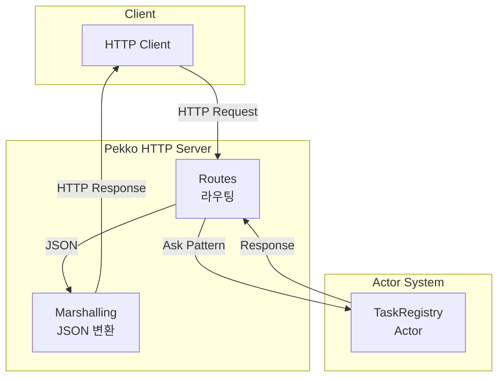
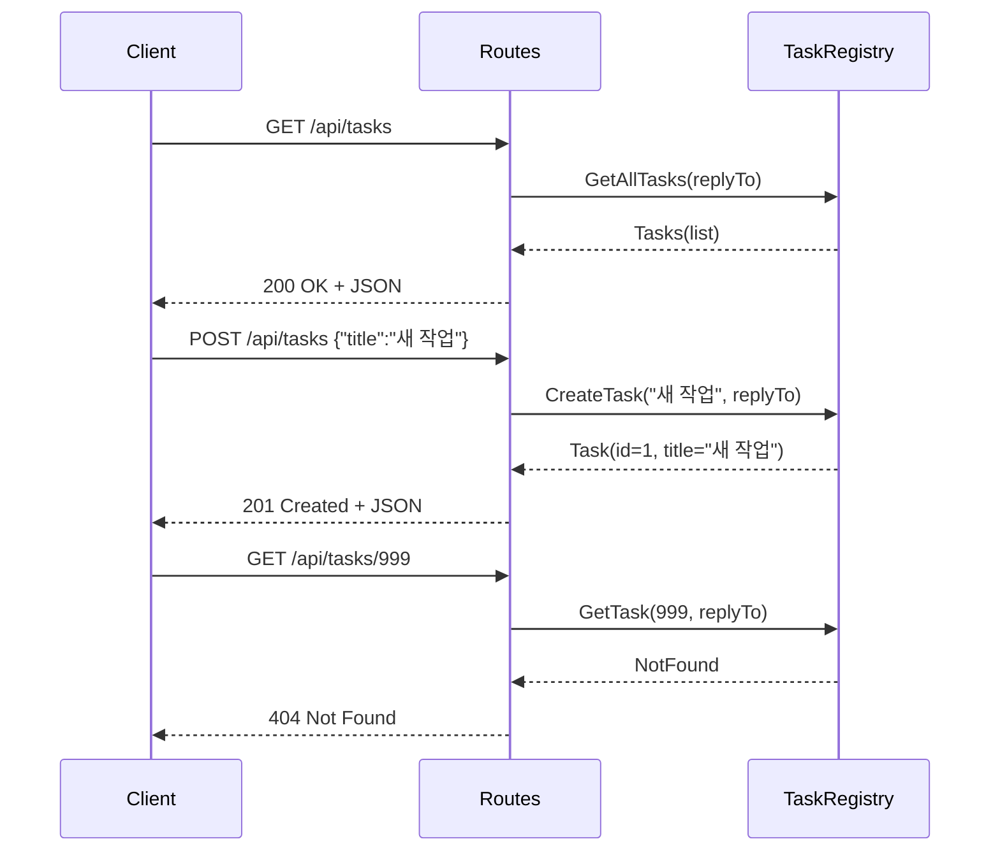

# Pekko HTTP 모듈

## 개요

이 모듈은 **Apache Pekko HTTP**를 사용하여 RESTful API 서버를 구축하는 방법을 보여줍니다.

## Pekko HTTP란?

Pekko HTTP는 HTTP 기반 서비스를 구축하기 위한 툴킷입니다. Pekko Streams 위에 구축되어 **백프레셔**와 **비동기 처리**를 기본 지원합니다.

### 아키텍처



---

## 프로젝트 구조

```
http/
├── build.gradle.kts
└── src/main/
    ├── kotlin/com/example/pekko/http/
    │   ├── HttpMain.kt         # 진입점
    │   ├── RootBehavior.kt     # 루트 Actor
    │   ├── TaskRegistry.kt     # Task CRUD Actor
    │   └── TaskRoutes.kt       # REST API 라우트
    └── resources/
        ├── application.conf
        └── logback.xml
```

---

## REST API 설계

### 엔드포인트

| Method | Path | 설명 |
|--------|------|------|
| `GET` | `/api/tasks` | 모든 Task 조회 |
| `GET` | `/api/tasks/{id}` | 특정 Task 조회 |
| `POST` | `/api/tasks` | 새 Task 생성 |
| `PUT` | `/api/tasks/{id}` | Task 업데이트 |
| `DELETE` | `/api/tasks/{id}` | Task 삭제 |

### 요청/응답 흐름



---

## 주요 컴포넌트

### 1. TaskRegistry Actor

Task 데이터를 메모리에서 관리하는 Actor입니다.

#### 메시지 정의

```kotlin
object TaskRegistry {
    // 커맨드
    sealed interface Command
    data class GetAllTasks(val replyTo: ActorRef<Tasks>) : Command
    data class GetTask(val id: Long, val replyTo: ActorRef<TaskResponse>) : Command
    data class CreateTask(val title: String, val replyTo: ActorRef<Task>) : Command
    data class UpdateTask(
        val id: Long,
        val title: String?,
        val completed: Boolean?,
        val replyTo: ActorRef<TaskResponse>
    ) : Command
    data class DeleteTask(val id: Long, val replyTo: ActorRef<TaskResponse>) : Command

    // 응답
    data class Tasks(val tasks: List<Task>)
    sealed interface TaskResponse {
        data class Found(val task: Task) : TaskResponse
        data object NotFound : TaskResponse
        data object Deleted : TaskResponse
    }
}
```

### 2. TaskRoutes

Pekko HTTP의 **Routing DSL**을 사용하여 REST API를 정의합니다.

```mermaid
flowchart TB
    subgraph Routes[TaskRoutes]
        P[pathPrefix "api"]
        PT[pathPrefix "tasks"]

        PE[pathEnd]
        PI[path {id}]

        GET1[GET → GetAllTasks]
        POST1[POST → CreateTask]
        GET2[GET → GetTask]
        PUT1[PUT → UpdateTask]
        DEL1[DELETE → DeleteTask]
    end

    P --> PT
    PT --> PE
    PT --> PI
    PE --> GET1
    PE --> POST1
    PI --> GET2
    PI --> PUT1
    PI --> DEL1
```

#### 코드 예제

```kotlin
class TaskRoutes(
    private val system: ActorSystem<*>,
    private val taskRegistry: ActorRef<TaskRegistry.Command>
) : AllDirectives() {

    fun routes(): Route = pathPrefix("api") {
        concat(
            taskRoutes()
        )
    }

    private fun taskRoutes(): Route = pathPrefix("tasks") {
        concat(
            // GET /api/tasks
            pathEnd {
                get {
                    val future = AskPattern.ask(
                        taskRegistry,
                        { replyTo -> TaskRegistry.GetAllTasks(replyTo) },
                        timeout,
                        system.scheduler()
                    )
                    onSuccess(future) { tasks ->
                        complete(StatusCodes.OK, tasks.tasks, Jackson.marshaller())
                    }
                }
            },
            // POST /api/tasks
            pathEnd {
                post {
                    entity(Jackson.unmarshaller(CreateTaskRequest::class.java)) { request ->
                        // ...
                    }
                }
            },
            // GET /api/tasks/{id}
            path(longSegment()) { id ->
                get {
                    // ...
                }
            }
        )
    }
}
```

---

## Routing DSL

### 주요 디렉티브

| 디렉티브 | 설명 |
|----------|------|
| `pathPrefix(segment)` | URL 경로 접두사 매칭 |
| `path(matcher)` | URL 경로 완전 매칭 |
| `pathEnd` | 경로 끝 매칭 |
| `get`, `post`, `put`, `delete` | HTTP 메서드 매칭 |
| `entity(unmarshaller)` | 요청 본문 파싱 |
| `complete(status, body, marshaller)` | 응답 반환 |
| `onSuccess(future)` | 비동기 결과 처리 |

### 경로 매처

| 매처 | 설명 | 예시 |
|------|------|------|
| `segment()` | 단일 경로 세그먼트 | `/api/users` → `"users"` |
| `longSegment()` | Long 타입 세그먼트 | `/api/tasks/123` → `123L` |
| `intSegment()` | Int 타입 세그먼트 | `/api/items/42` → `42` |

---

## JSON 직렬화 (Jackson)

Pekko HTTP는 Jackson을 사용하여 JSON 변환을 처리합니다.

```kotlin
// 요청 DTO
data class CreateTaskRequest(val title: String = "")
data class UpdateTaskRequest(val title: String? = null, val completed: Boolean? = null)

// 응답 모델
data class Task(val id: Long, val title: String, val completed: Boolean = false)

// 마샬러 사용
complete(StatusCodes.OK, task, Jackson.marshaller())
entity(Jackson.unmarshaller(CreateTaskRequest::class.java)) { request -> ... }
```

---

## 실행 방법

```bash
# 서버 시작
./gradlew :http:run
# 서버가 http://localhost:8080 에서 실행됨
```

### API 테스트

```bash
# 모든 Task 조회
curl http://localhost:8080/api/tasks

# 특정 Task 조회
curl http://localhost:8080/api/tasks/1

# Task 생성
curl -X POST -H "Content-Type: application/json" \
  -d '{"title":"새 작업"}' \
  http://localhost:8080/api/tasks

# Task 업데이트
curl -X PUT -H "Content-Type: application/json" \
  -d '{"completed":true}' \
  http://localhost:8080/api/tasks/1

# Task 삭제
curl -X DELETE http://localhost:8080/api/tasks/1
```

---

## HTTP 상태 코드

| 코드 | 의미 | 사용 |
|------|------|------|
| `200 OK` | 성공 | GET, PUT 성공 |
| `201 Created` | 생성됨 | POST 성공 |
| `204 No Content` | 내용 없음 | DELETE 성공 |
| `404 Not Found` | 찾을 수 없음 | 리소스가 존재하지 않음 |
| `500 Internal Server Error` | 서버 오류 | 예상치 못한 오류 |

---

## 의존성

```kotlin
dependencies {
    implementation("org.apache.pekko:pekko-actor-typed_2.13")
    implementation("org.apache.pekko:pekko-stream_2.13")
    implementation("org.apache.pekko:pekko-http_2.13:1.1.0")
    implementation("org.apache.pekko:pekko-http-jackson_2.13:1.1.0")

    // Jackson Kotlin 지원
    implementation("com.fasterxml.jackson.module:jackson-module-kotlin:2.17.0")
}
```

---

## 참고 자료

- [Pekko HTTP 문서](https://pekko.apache.org/docs/pekko-http/current/)
- [Routing DSL](https://pekko.apache.org/docs/pekko-http/current/routing-dsl/index.html)
- [Marshalling](https://pekko.apache.org/docs/pekko-http/current/common/json-support.html)
