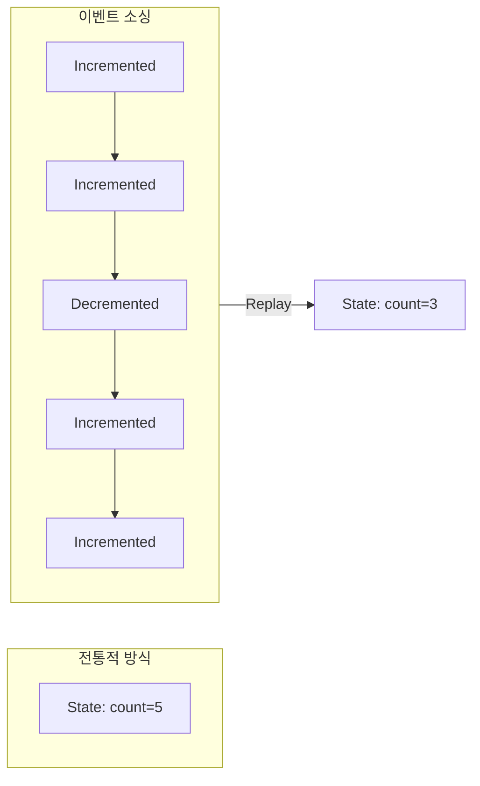
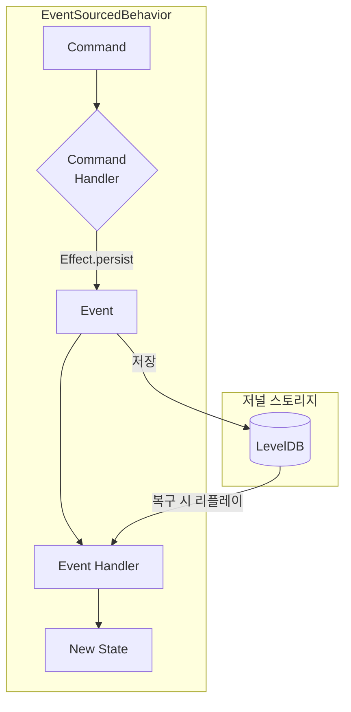
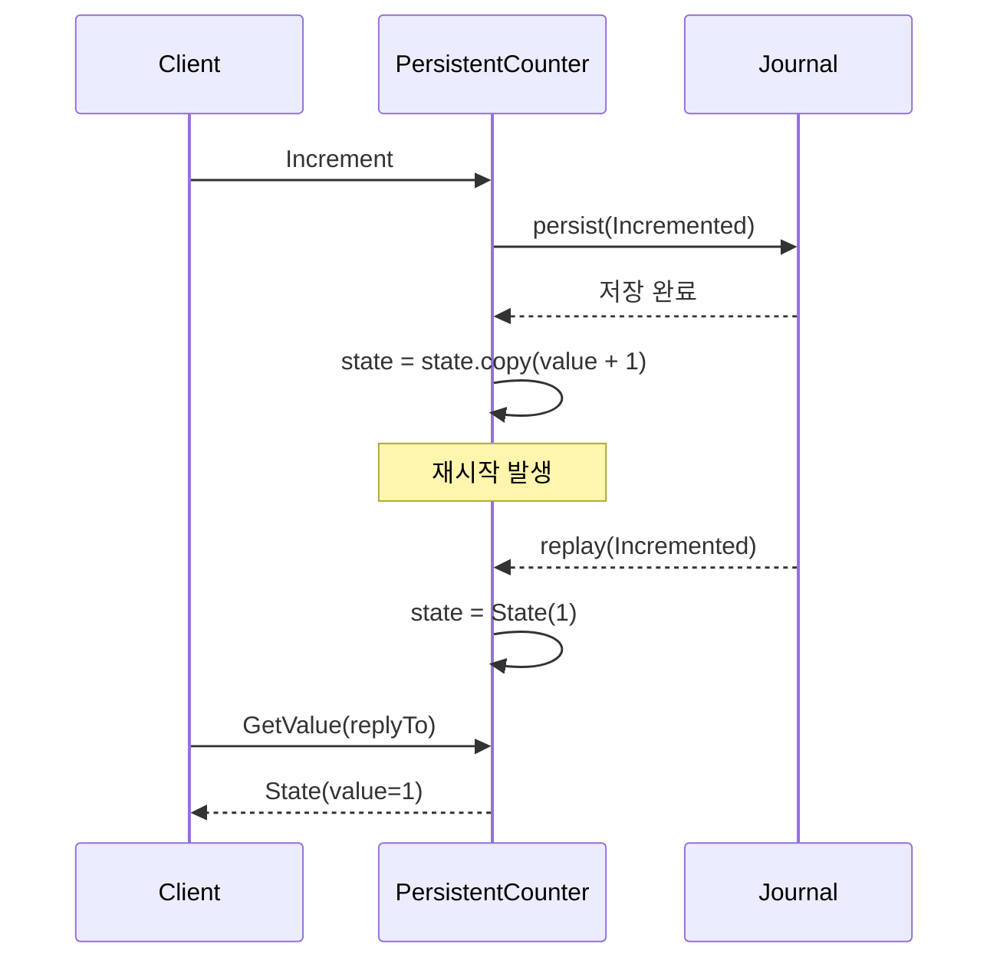
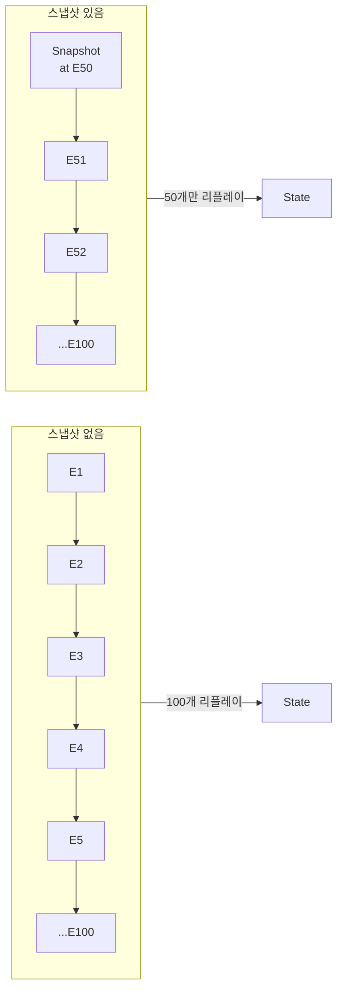

# Pekko Persistence 모듈

## 개요

이 모듈은 **Apache Pekko Persistence**를 사용하여 이벤트 소싱(Event Sourcing) 패턴을 구현하는 방법을 보여줍니다.

## Event Sourcing이란?

상태를 직접 저장하는 대신, **상태를 변경한 이벤트들의 시퀀스**를 저장하는 패턴입니다.



### 이벤트 소싱의 장점

| 장점 | 설명 |
|------|------|
| **완전한 감사 로그** | 모든 변경 이력이 보존됨 |
| **시간 여행** | 과거 어느 시점의 상태로든 복원 가능 |
| **이벤트 리플레이** | 새로운 뷰/프로젝션 생성 가능 |
| **장애 복구** | 이벤트 리플레이로 상태 자동 복구 |

---

## 프로젝트 구조

```
persistence/
├── build.gradle.kts
└── src/main/
    ├── kotlin/com/example/pekko/persistence/
    │   ├── PersistentCounter.kt    # EventSourcedBehavior 구현
    │   ├── CborSerializable.kt     # 직렬화 마커
    │   └── PersistenceMain.kt      # 진입점
    └── resources/
        ├── application.conf        # 저널 설정
        └── logback.xml
```

---

## EventSourcedBehavior 구조



### 핵심 구성 요소

| 구성 요소 | 역할 |
|-----------|------|
| **Command** | Actor에게 보내는 요청 메시지 |
| **Event** | 상태 변경을 나타내는 불변 이벤트 |
| **State** | 현재 상태 (이벤트 적용 결과) |
| **Command Handler** | 커맨드를 받아 이벤트 생성 결정 |
| **Event Handler** | 이벤트를 상태에 적용 |

---

## 주요 컴포넌트

### PersistentCounter

영속적인 카운터 Actor입니다. 재시작해도 상태가 유지됩니다.

#### 타입 정의

```kotlin
// 커맨드 (요청)
sealed interface Command : CborSerializable
data object Increment : Command
data object Decrement : Command
data class GetValue(val replyTo: ActorRef<State>) : Command

// 이벤트 (상태 변경 기록)
sealed interface Event : CborSerializable
data object Incremented : Event
data object Decremented : Event

// 상태
data class State(val value: Int = 0) : CborSerializable
```

#### 동작 흐름



#### 코드 예제

```kotlin
object PersistentCounter {

    fun create(persistenceId: PersistenceId): Behavior<Command> {
        return Behaviors.setup { context ->
            EventSourcedBehavior.create(
                persistenceId,
                State(),  // 초기 상태
                ::commandHandler,
                ::eventHandler
            )
        }
    }

    // 커맨드 핸들러: 커맨드 → 이벤트 (또는 부수효과)
    private fun commandHandler(state: State, command: Command): Effect<Event, State> {
        return when (command) {
            is Increment -> Effect().persist(Incremented)
            is Decrement -> Effect().persist(Decremented)
            is GetValue -> {
                command.replyTo.tell(state)
                Effect().none()
            }
        }
    }

    // 이벤트 핸들러: 이벤트 → 새 상태
    private fun eventHandler(state: State, event: Event): State {
        return when (event) {
            is Incremented -> state.copy(value = state.value + 1)
            is Decremented -> state.copy(value = state.value - 1)
        }
    }
}
```

---

## 설정 (application.conf)

```hocon
pekko {
  actor {
    serialization-bindings {
      "com.example.pekko.persistence.CborSerializable" = jackson-cbor
    }
  }

  persistence {
    journal {
      plugin = "pekko.persistence.journal.leveldb"
      leveldb {
        dir = "target/journal"
        native = false  # 순수 Java 구현 사용
      }
    }

    snapshot-store {
      plugin = "pekko.persistence.snapshot-store.local"
      local.dir = "target/snapshots"
    }
  }
}
```

### 저널 플러그인 옵션

| 플러그인 | 용도 |
|----------|------|
| `leveldb` | 로컬 개발/테스트용 (파일 기반) |
| `jdbc` | PostgreSQL, MySQL 등 RDBMS |
| `cassandra` | 분산 환경용 (고가용성) |
| `inmem` | 테스트용 (메모리) |

---

## 스냅샷

이벤트가 많아지면 복구 시간이 길어집니다. 스냅샷으로 이를 최적화합니다.



#### 스냅샷 설정

```kotlin
EventSourcedBehavior.create(...)
    .withRetention(
        RetentionCriteria.snapshotEvery(100, 2)  // 100개마다 스냅샷, 최근 2개 유지
    )
```

---

## 실행 방법

```bash
# 첫 번째 실행
./gradlew :persistence:run
# 출력: 현재 값: 0 → Increment 3회 → 현재 값: 3

# 두 번째 실행 (상태 복구 확인)
./gradlew :persistence:run
# 출력: 현재 값: 3 (이전 상태 복구됨) → Increment 3회 → 현재 값: 6
```

---

## 테스트

Kotest FunSpec 스타일로 작성된 테스트:

```bash
./gradlew :persistence:test
```

### 테스트 예제 (Kotest)

```kotlin
class PersistentCounterTest : FunSpec({

    // 인메모리 저널 설정
    val config = ConfigFactory.parseString("""
        pekko.persistence.journal.plugin = "pekko.persistence.journal.inmem"
        pekko.persistence.snapshot-store.plugin = "pekko.persistence.snapshot-store.local"
        pekko.persistence.snapshot-store.local.dir = "target/test-snapshots"
    """).withFallback(ConfigFactory.load())

    val testKit = ActorTestKit.create(config)

    afterSpec {
        testKit.shutdownTestKit()
    }

    test("Increment로 상태가 증가해야 한다") {
        val probe = testKit.createTestProbe<PersistentCounter.State>()
        val counter = testKit.spawn(
            PersistentCounter.create(PersistenceId.ofUniqueId("test-counter-1"))
        )

        counter.tell(PersistentCounter.Increment)
        counter.tell(PersistentCounter.GetValue(probe.ref()))

        probe.receiveMessage().value shouldBe 1
    }
}
```

테스트 파일:
- `PersistentCounterTest.kt`

---

## 의존성

```kotlin
dependencies {
    implementation("org.apache.pekko:pekko-actor-typed_2.13")
    implementation("org.apache.pekko:pekko-persistence-typed_2.13")
    implementation("org.apache.pekko:pekko-serialization-jackson_2.13")

    // LevelDB 저널
    implementation("org.iq80.leveldb:leveldb:0.12")
}
```

---

## 참고 자료

- [Pekko Persistence 문서](https://pekko.apache.org/docs/pekko/current/typed/persistence.html)
- [Event Sourcing 패턴](https://martinfowler.com/eaaDev/EventSourcing.html)
- [스냅샷 문서](https://pekko.apache.org/docs/pekko/current/typed/persistence-snapshot.html)
