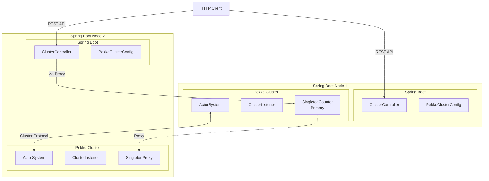

# Spring Boot + Pekko Cluster 통합 예제

이 모듈은 Spring Boot 프레임워크와 Apache Pekko Cluster를 함께 사용하는 방법을 보여줍니다.

## 아키텍처



## Cluster Singleton 패턴

Cluster Singleton은 전체 클러스터에서 **단 하나의 Actor 인스턴스**만 실행되도록 보장합니다:

- **자동 Failover**: 싱글톤이 실행 중인 노드가 다운되면 다른 노드에서 자동 재시작
- **위치 투명성**: 어떤 노드에서든 싱글톤에 메시지를 보낼 수 있음
- **일관성**: 클러스터 전체에서 상태 일관성 유지

## 주요 구성 요소

### 1. CborSerializable (`actor/CborSerializable.kt`)
- 클러스터 노드 간 메시지 직렬화를 위한 마커 인터페이스
- Jackson CBOR 직렬화 사용

### 2. ClusterListener (`actor/ClusterListener.kt`)
- 클러스터 멤버십 이벤트 수신
- 노드 Join/Leave/Unreachable 상태 로깅

### 3. SingletonCounter (`actor/SingletonCounter.kt`)
- Cluster Singleton으로 실행되는 카운터 Actor
- 증가, 감소, 조회, 리셋 기능 제공

### 4. PekkoClusterConfig (`config/PekkoClusterConfig.kt`)
- ActorSystem을 Cluster 모드로 생성
- ClusterListener 및 SingletonCounter 초기화

### 5. ClusterController (`controller/ClusterController.kt`)
- 클러스터 상태 조회 REST API
- 싱글톤 카운터 조작 REST API

## 실행 방법

### 단일 노드 실행

```bash
./gradlew :spring-boot-cluster:bootRun
```

서버가 시작되면 http://localhost:8083 에서 접근 가능합니다.

### 다중 노드 실행 (클러스터 테스트)

```bash
# 터미널 1: 첫 번째 노드 (seed node)
./gradlew :spring-boot-cluster:bootRun

# 터미널 2: 두 번째 노드
PEKKO_REMOTE_PORT=25521 SERVER_PORT=8084 ./gradlew :spring-boot-cluster:bootRun

# 터미널 3: 세 번째 노드
PEKKO_REMOTE_PORT=25522 SERVER_PORT=8085 ./gradlew :spring-boot-cluster:bootRun
```

## API 엔드포인트

| Method | Endpoint | 설명 |
|--------|----------|------|
| GET | `/api/cluster/status` | 클러스터 상태 조회 |
| GET | `/api/cluster/counter` | 카운터 값 조회 |
| POST | `/api/cluster/counter/increment` | 카운터 증가 |
| POST | `/api/cluster/counter/decrement` | 카운터 감소 |
| POST | `/api/cluster/counter/reset` | 카운터 리셋 |

## API 사용 예시

### 클러스터 상태 조회
```bash
curl http://localhost:8083/api/cluster/status
```

응답 예시:
```json
{
  "selfAddress": "pekko://spring-cluster-system@127.0.0.1:25520",
  "selfRoles": ["backend"],
  "selfStatus": "Up",
  "leader": "pekko://spring-cluster-system@127.0.0.1:25520",
  "members": [
    {
      "address": "pekko://spring-cluster-system@127.0.0.1:25520",
      "status": "Up",
      "roles": ["backend"]
    }
  ],
  "unreachable": []
}
```

### 카운터 조작
```bash
# 카운터 증가
curl -X POST "http://localhost:8083/api/cluster/counter/increment?delta=5"

# 카운터 조회
curl http://localhost:8083/api/cluster/counter

# 카운터 감소
curl -X POST "http://localhost:8083/api/cluster/counter/decrement?delta=2"

# 카운터 리셋
curl -X POST http://localhost:8083/api/cluster/counter/reset
```

## Split Brain Resolver (SBR)

네트워크 파티션 발생 시 클러스터 일관성을 유지하기 위한 전략:

```hocon
cluster.split-brain-resolver {
  active-strategy = "keep-majority"
  stable-after = 10s
}
```

- **keep-majority**: 과반수 노드가 있는 파티션을 유지
- **keep-oldest**: 가장 오래된 노드가 있는 파티션을 유지
- **keep-referee**: 지정된 referee 노드가 있는 파티션을 유지
- **down-all**: 모든 노드 다운 (안전 우선)

## 테스트

```bash
./gradlew :spring-boot-cluster:test
```

## 의존성

- Spring Boot 4.0.1
- Apache Pekko 1.4.0
- Apache Pekko Cluster 1.4.0
- Kotlin 2.3.0
- Kotest 6.0.5

## 참고 자료

- [Pekko Cluster 문서](https://pekko.apache.org/docs/pekko/current/typed/cluster.html)
- [Pekko Cluster Singleton](https://pekko.apache.org/docs/pekko/current/typed/cluster-singleton.html)
- [Split Brain Resolver](https://pekko.apache.org/docs/pekko/current/split-brain-resolver.html)
