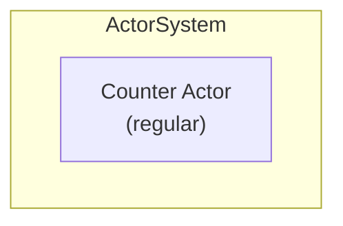
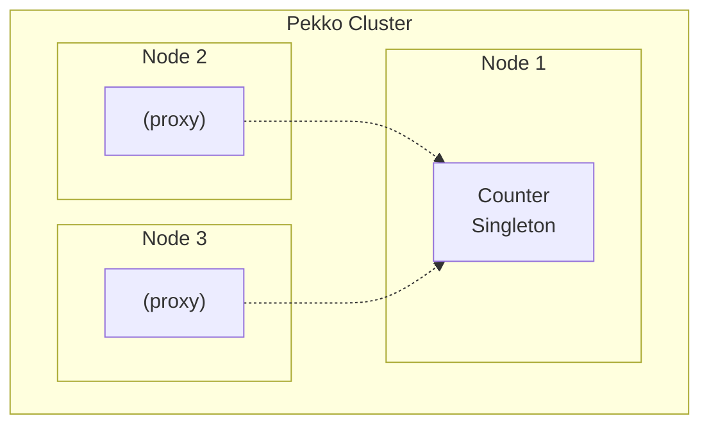

# Spring Boot Optional Cluster Module

This module demonstrates how to create a Pekko application that can run in both **standalone** and **cluster** modes, configurable via a simple property.

## Features

- **Configurable Mode**: Switch between standalone and cluster mode via `pekko.cluster.enabled` property
- **Conditional Bean Configuration**: Uses Spring's `@ConditionalOnProperty` for mode-specific beans
- **Same Actor Logic**: The `Counter` actor works in both modes without modification
- **ClusterSingleton in Cluster Mode**: Counter becomes a cluster singleton when cluster is enabled
- **Mode-Aware API**: REST endpoints indicate current mode in responses

## Configuration

### application.yml

```yaml
pekko:
  cluster:
    enabled: false  # Set to true for cluster mode
    hostname: 127.0.0.1
    port: 25520
    seed-nodes:
      - "pekko://optional-cluster-system@127.0.0.1:25520"
```

## Running

### Standalone Mode (default)

```bash
./gradlew :spring-boot-optional-cluster:bootRun
```

### Cluster Mode

Using Spring profile:
```bash
./gradlew :spring-boot-optional-cluster:bootRun --args='--spring.profiles.active=cluster'
```

Or with environment variable:
```bash
PEKKO_CLUSTER_ENABLED=true ./gradlew :spring-boot-optional-cluster:bootRun
```

### Running Multiple Cluster Nodes

```bash
# Node 1 (seed node)
./gradlew :spring-boot-optional-cluster:bootRun --args='--spring.profiles.active=cluster --server.port=8080'

# Node 2
./gradlew :spring-boot-optional-cluster:bootRun --args='--spring.profiles.active=cluster --server.port=8081 --pekko.cluster.port=25521'

# Node 3
./gradlew :spring-boot-optional-cluster:bootRun --args='--spring.profiles.active=cluster --server.port=8082 --pekko.cluster.port=25522'
```

## API Endpoints

### Counter Operations (available in both modes)

| Method | Endpoint | Description |
|--------|----------|-------------|
| GET | `/api/counter` | Get current counter value |
| POST | `/api/counter/increment?delta=1` | Increment counter |
| POST | `/api/counter/decrement?delta=1` | Decrement counter |
| POST | `/api/counter/reset` | Reset counter to 0 |
| GET | `/api/counter/mode` | Get current mode info |

### Cluster Status (cluster mode only)

| Method | Endpoint | Description |
|--------|----------|-------------|
| GET | `/api/cluster/status` | Get cluster membership status |

## Example Responses

### Standalone Mode

```bash
$ curl http://localhost:8080/api/counter/mode
{
  "clusterEnabled": false,
  "mode": "standalone",
  "description": "Counter is running as a standalone actor"
}
```

### Cluster Mode

```bash
$ curl http://localhost:8080/api/counter/mode
{
  "clusterEnabled": true,
  "mode": "cluster",
  "description": "Counter is running as a ClusterSingleton"
}
```

## Architecture

### Standalone Mode



### Cluster Mode



## Key Classes

| Class | Description |
|-------|-------------|
| `PekkoProperties` | Configuration properties for cluster settings |
| `PekkoConfig` | Creates ActorSystem based on cluster.enabled |
| `StandaloneActorConfig` | Bean configuration for standalone mode |
| `ClusterActorConfig` | Bean configuration for cluster mode |
| `Counter` | Actor that works in both modes |
| `ClusterListener` | Cluster event listener (cluster mode only) |
