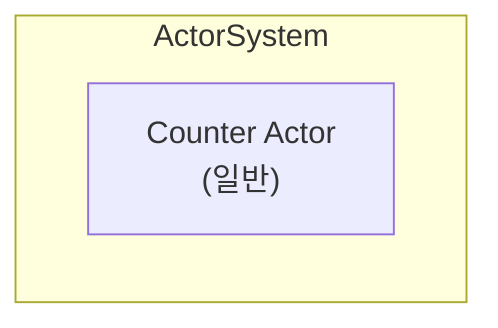
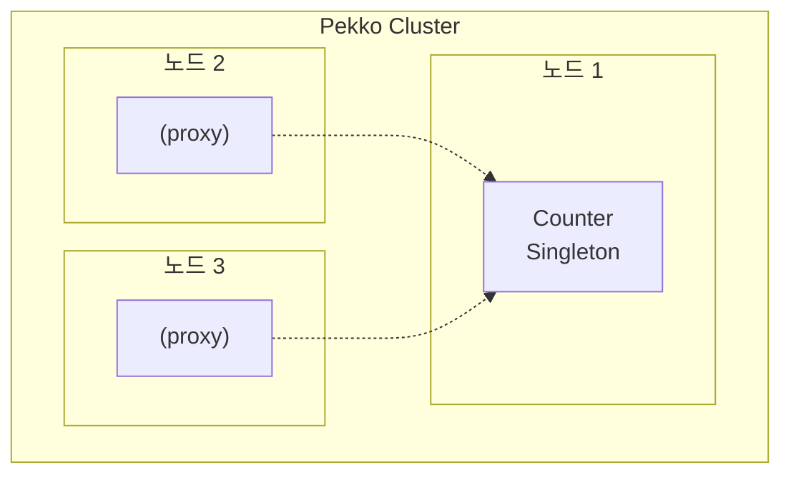

# Spring Boot 선택적 클러스터 모듈

이 모듈은 **단독 모드**와 **클러스터 모드** 모두에서 실행할 수 있는 Pekko 애플리케이션을 만드는 방법을 보여줍니다. 간단한 프로퍼티로 설정할 수 있습니다.

## 기능

- **설정 가능한 모드**: `pekko.cluster.enabled` 프로퍼티로 단독/클러스터 모드 전환
- **조건부 Bean 설정**: Spring의 `@ConditionalOnProperty`를 사용한 모드별 Bean 구성
- **동일한 Actor 로직**: `Counter` Actor가 수정 없이 두 모드에서 모두 동작
- **클러스터 모드에서 ClusterSingleton**: 클러스터 활성화 시 Counter가 클러스터 싱글톤이 됨
- **모드 인식 API**: REST 엔드포인트가 응답에 현재 모드 정보 포함

## 설정

### application.yml

```yaml
pekko:
  cluster:
    enabled: false  # 클러스터 모드는 true로 설정
    hostname: 127.0.0.1
    port: 25520
    seed-nodes:
      - "pekko://optional-cluster-system@127.0.0.1:25520"
```

## 실행 방법

### 단독 모드 (기본값)

```bash
./gradlew :spring-boot-optional-cluster:bootRun
```

### 클러스터 모드

Spring 프로파일 사용:

```bash
./gradlew :spring-boot-optional-cluster:bootRun --args='--spring.profiles.active=cluster'
```

또는 환경 변수 사용:

```bash
PEKKO_CLUSTER_ENABLED=true ./gradlew :spring-boot-optional-cluster:bootRun
```

### 다중 클러스터 노드 실행

```bash
# 노드 1 (seed 노드)
./gradlew :spring-boot-optional-cluster:bootRun --args='--spring.profiles.active=cluster --server.port=8080'

# 노드 2
./gradlew :spring-boot-optional-cluster:bootRun --args='--spring.profiles.active=cluster --server.port=8081 --pekko.cluster.port=25521'

# 노드 3
./gradlew :spring-boot-optional-cluster:bootRun --args='--spring.profiles.active=cluster --server.port=8082 --pekko.cluster.port=25522'
```

## API 엔드포인트

### 카운터 작업 (두 모드 모두 사용 가능)

| Method | Endpoint                         | 설명           |
|--------|----------------------------------|--------------|
| GET    | `/api/counter`                   | 현재 카운터 값 조회  |
| POST   | `/api/counter/increment?delta=1` | 카운터 증가       |
| POST   | `/api/counter/decrement?delta=1` | 카운터 감소       |
| POST   | `/api/counter/reset`             | 카운터를 0으로 리셋  |
| GET    | `/api/counter/mode`              | 현재 모드 정보 조회  |

### 클러스터 상태 (클러스터 모드 전용)

| Method | Endpoint              | 설명             |
|--------|-----------------------|----------------|
| GET    | `/api/cluster/status` | 클러스터 멤버십 상태 조회 |

## 응답 예시

### 단독 모드

```bash
$ curl http://localhost:8080/api/counter/mode
{
  "clusterEnabled": false,
  "mode": "standalone",
  "description": "Counter is running as a standalone actor"
}
```

### 클러스터 모드

```bash
$ curl http://localhost:8080/api/counter/mode
{
  "clusterEnabled": true,
  "mode": "cluster",
  "description": "Counter is running as a ClusterSingleton"
}
```

## 아키텍처

### 단독 모드



### 클러스터 모드



## 주요 클래스

| 클래스                    | 설명                           |
|------------------------|------------------------------|
| `PekkoProperties`      | 클러스터 설정 프로퍼티                 |
| `PekkoConfig`          | cluster.enabled에 따라 ActorSystem 생성 |
| `StandaloneActorConfig` | 단독 모드용 Bean 설정               |
| `ClusterActorConfig`   | 클러스터 모드용 Bean 설정             |
| `Counter`              | 두 모드 모두에서 동작하는 Actor         |
| `ClusterListener`      | 클러스터 이벤트 리스너 (클러스터 모드 전용)   |
