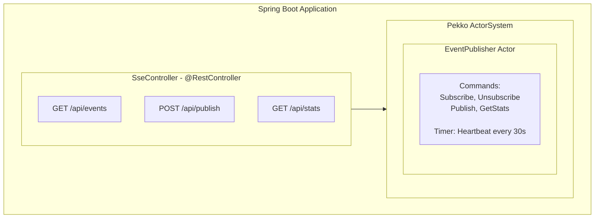

# Spring Boot SSE Module

This module demonstrates Server-Sent Events (SSE) integration with Spring Boot and Pekko Actors.

## Features

- **Spring WebFlux SSE**: Reactive event streaming
- **Pekko Actor Integration**: EventPublisher actor manages subscriptions
- **Multiple Event Types**: Support for different event categories
- **Heartbeat**: Automatic keep-alive every 30 seconds
- **Statistics Endpoint**: Monitor subscriber count and event totals

## Architecture



## Running

```bash
./gradlew :spring-boot-sse:bootRun
```

Server starts at:
- HTTP: http://localhost:8083/
- SSE: http://localhost:8083/api/events

## API

### SSE Endpoint

**GET /api/events**

Connect to receive server-sent events.

```bash
curl -N http://localhost:8083/api/events
```

Event format:
```
id: <uuid>
event: <event-type>
data: {"data": "<payload>", "timestamp": 1703123456789}

```

### REST API

| Method | Endpoint                        | Description                    |
|--------|---------------------------------|--------------------------------|
| GET    | `/api/events`                   | SSE event stream               |
| POST   | `/api/publish?type=<eventType>` | Publish an event (body = data) |
| GET    | `/api/stats`                    | Get publisher statistics       |

### Publish Event

```bash
curl -X POST "http://localhost:8083/api/publish?type=notification" \
  -H "Content-Type: text/plain" \
  -d "Hello, SSE!"
```

### Get Stats

```bash
curl http://localhost:8083/api/stats
```

Response:
```json
{
  "subscriberCount": 3,
  "totalEventsPublished": 42
}
```

## Event Types

| Type           | Description                      |
|----------------|----------------------------------|
| `connected`    | Sent on initial connection       |
| `notification` | General notifications            |
| `alert`        | Important alerts                 |
| `update`       | Data updates                     |
| `heartbeat`    | Keep-alive (automatic every 30s) |

## Testing

```bash
./gradlew :spring-boot-sse:test
```

## Testing with Browser

Open http://localhost:8083/ in your browser to use the built-in SSE demo UI.

## Testing with curl

```bash
# Subscribe to events (runs until Ctrl+C)
curl -N http://localhost:8083/api/events

# In another terminal, publish events
curl -X POST "http://localhost:8083/api/publish?type=notification" -d "Test message"
```

## Integration Points

### Pekko Actor with Spring WebFlux

The integration uses Reactor's `Sinks` to bridge:
1. Pekko actor callbacks → Reactive stream emissions
2. SSE subscription → Actor Subscribe command
3. SSE disconnect → Actor Unsubscribe command

### Key Classes

- **PekkoConfig**: Creates ActorSystem and EventPublisher as Spring Beans
- **SseController**: WebFlux SSE endpoints
- **EventPublisher**: Actor managing pub/sub and heartbeat

## Comparison with Pure Pekko Module

| Feature      | Spring Boot          | Pure Pekko              |
|--------------|----------------------|-------------------------|
| Framework    | Spring WebFlux       | Pekko HTTP              |
| SSE Format   | ServerSentEvent<T>   | Source<ServerSentEvent> |
| Reactive     | Project Reactor      | Pekko Streams           |
| Dependencies | Spring ecosystem     | Minimal                 |
| Use Case     | Enterprise apps      | Microservices           |
