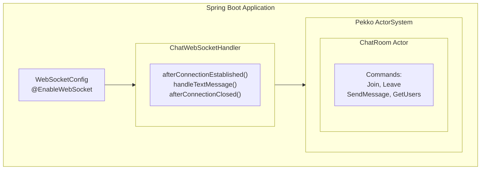

# Spring Boot WebSocket 모듈

이 모듈은 Spring Boot와 Pekko Actor를 사용한 WebSocket 통합을 보여줍니다.

## 기능

- **Spring WebSocket**: 네이티브 Spring WebSocket 지원
- **Pekko Actor 통합**: ChatRoom Actor가 채팅 상태 관리
- **실시간 채팅**: 양방향 WebSocket 통신
- **JSON 메시지**: 구조화된 메시지 프로토콜

## 아키텍처



## 실행 방법

```bash
./gradlew :spring-boot-websocket:bootRun
```

서버 시작 위치:

- HTTP: http://localhost:8082/
- WebSocket: ws://localhost:8082/ws/chat

## API

### WebSocket 엔드포인트

**ws://localhost:8082/ws/chat**

#### 클라이언트 → 서버 메시지

**채팅 참여**

```json
{
  "type": "JOIN",
  "username": "Alice"
}
```

**메시지 전송**

```json
{
  "type": "MESSAGE",
  "content": "안녕하세요!"
}
```

**채팅 나가기**

```json
{
  "type": "LEAVE"
}
```

#### 서버 → 클라이언트 메시지

**채팅 메시지**

```json
{
  "type": "CHAT",
  "username": "Alice",
  "content": "안녕하세요!",
  "timestamp": 1703123456789
}
```

**시스템 메시지**

```json
{
  "type": "SYSTEM",
  "content": "Alice님이 채팅에 참여했습니다",
  "timestamp": 1703123456789
}
```

## 테스트

```bash
./gradlew :spring-boot-websocket:test
```

## 통합 포인트

### Pekko Actor 생명주기

`PekkoConfig` 클래스가 관리:

1. Spring 생명주기와 함께 ActorSystem 생성
2. ChatRoom Actor를 Spring Bean으로 생성
3. 애플리케이션 종료 시 정상 종료

### Spring WebSocket 통합

`ChatWebSocketHandler`가 연결:

1. Spring WebSocket 세션 → Pekko Actor 메시지
2. Actor 콜백 → WebSocket 텍스트 메시지
3. 세션 생명주기 → Actor Join/Leave 커맨드

## Pure Pekko 모듈과의 비교

| 기능       | Spring Boot      | Pure Pekko   |
|----------|------------------|--------------|
| 프레임워크    | Spring WebSocket | Pekko HTTP   |
| 설정       | @EnableWebSocket | Routes DSL   |
| 세션 관리    | Spring 관리        | ActorSource  |
| 의존성      | Spring 생태계       | 최소           |
| 사용 사례    | 엔터프라이즈 앱         | 마이크로서비스      |
