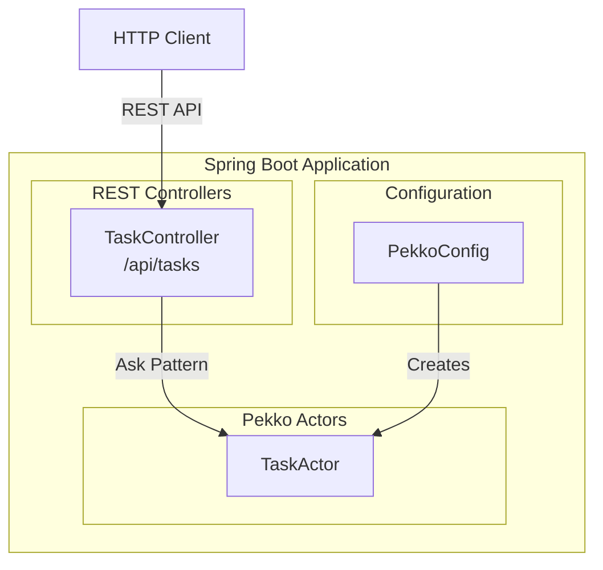

# Spring Boot + Pekko Actor 통합 예제

이 모듈은 Spring Boot 프레임워크와 Apache Pekko Actor를 함께 사용하는 방법을 보여줍니다.

## 아키텍처



## 주요 구성 요소

### 1. PekkoConfig (`config/PekkoConfig.kt`)
- `ActorSystem`을 Spring Bean으로 등록
- `TaskActor`를 spawn하여 Bean으로 관리
- Spring 생명주기에 맞춰 ActorSystem graceful shutdown

### 2. TaskActor (`actor/TaskActor.kt`)
- Task CRUD 작업을 처리하는 Actor
- Command 패턴으로 메시지 정의
- 상태를 내부 ConcurrentHashMap으로 관리

### 3. TaskController (`controller/TaskController.kt`)
- REST API 엔드포인트 제공
- Ask 패턴으로 Actor와 통신
- CompletionStage를 반환하여 비동기 처리

## 실행 방법

```bash
# 프로젝트 루트에서
./gradlew :spring-boot:bootRun
```

서버가 시작되면 http://localhost:8081 에서 접근 가능합니다.

## API 엔드포인트

| Method | Endpoint                   | 설명            |
|--------|----------------------------|---------------|
| GET    | `/api/tasks`               | 모든 Task 조회    |
| GET    | `/api/tasks/{id}`          | ID로 Task 조회   |
| POST   | `/api/tasks`               | 새 Task 생성     |
| PATCH  | `/api/tasks/{id}/toggle`   | Task 완료 상태 토글 |
| DELETE | `/api/tasks/{id}`          | Task 삭제       |

## API 사용 예시

### Task 생성
```bash
curl -X POST http://localhost:8081/api/tasks \
  -H "Content-Type: application/json" \
  -d '{"title": "새 작업", "description": "작업 설명"}'
```

### 모든 Task 조회
```bash
curl http://localhost:8081/api/tasks
```

### Task 완료 토글
```bash
curl -X PATCH http://localhost:8081/api/tasks/{id}/toggle
```

### Task 삭제
```bash
curl -X DELETE http://localhost:8081/api/tasks/{id}
```

## Spring Boot와 Pekko 통합의 이점

1. **DI (Dependency Injection)**: Spring의 DI로 ActorRef를 쉽게 주입
2. **생명주기 관리**: Spring이 ActorSystem 생명주기를 자동 관리
3. **설정 통합**: application.yml과 application.conf 함께 사용
4. **테스트 용이성**: Spring Test와 Pekko TestKit 함께 활용
5. **기존 Spring 에코시스템 활용**: Spring Security, Spring Data 등과 조합 가능

## 테스트

Kotest FunSpec 스타일로 작성된 테스트:

```bash
./gradlew :spring-boot:test
```

### 테스트 예제 (Kotest)

```kotlin
class TaskActorTest : FunSpec({

    val testKit = ActorTestKit.create()

    afterSpec {
        testKit.shutdownTestKit()
    }

    test("CreateTask로 새 Task를 생성할 수 있다") {
        val taskActor = testKit.spawn(TaskActor.create())
        val probe = testKit.createTestProbe<TaskResponse>()

        taskActor.tell(CreateTask("테스트 작업", "설명", probe.ref()))

        val response = probe.receiveMessage()
        response.shouldBeInstanceOf<SingleTask>().task.title shouldBe "테스트 작업"
    }
})
```

테스트 파일:
- `TaskActorTest.kt`

## 의존성

- Spring Boot 4.0.1
- Apache Pekko 1.4.0
- Kotlin 2.3.0
- Kotest 6.0.5
