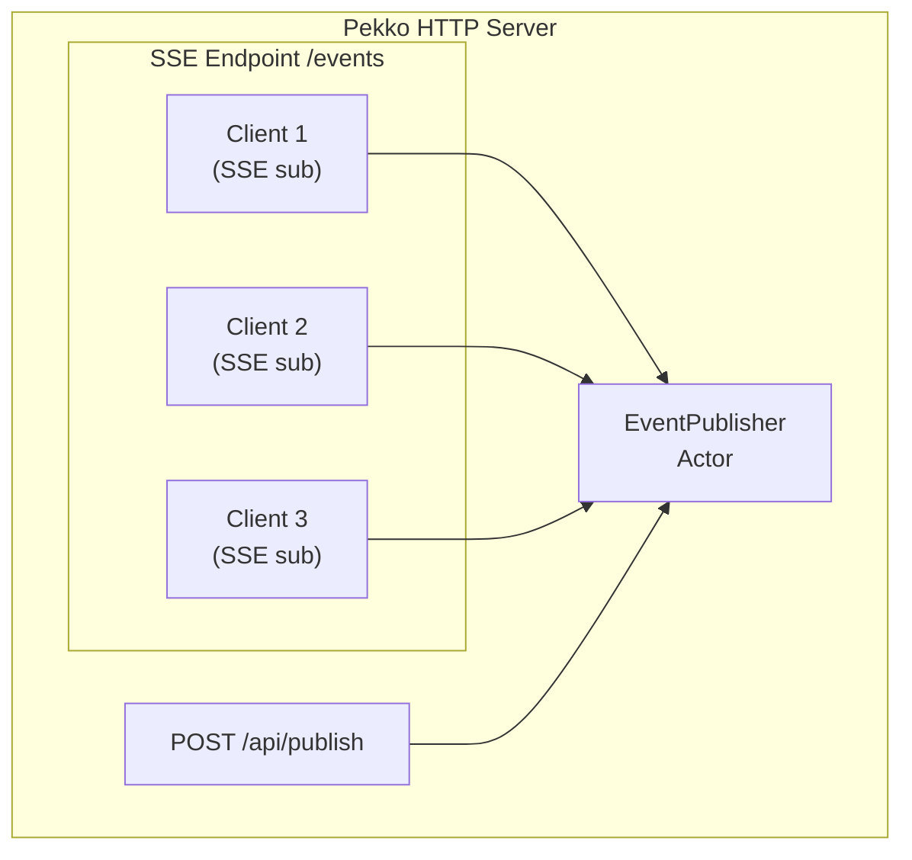

# SSE 모듈 (Pure Pekko HTTP)

이 모듈은 순수 Pekko HTTP와 Actor를 사용한 Server-Sent Events (SSE) 구현을 보여줍니다.

## 기능

- **이벤트 스트리밍**: 실시간 서버-클라이언트 이벤트 스트리밍
- **Actor 기반 Pub/Sub**: EventPublisher Actor가 구독 관리
- **다양한 이벤트 타입**: 여러 이벤트 카테고리 지원
- **하트비트**: 장기 연결을 위한 Keep-alive 메커니즘

## 아키텍처



## 실행 방법

```bash
./gradlew :sse:run
```

서버 시작 위치:

- HTTP: http://localhost:8081/
- SSE: http://localhost:8081/events

## API

### SSE 엔드포인트

**GET /events**

서버 전송 이벤트를 수신하기 위해 연결합니다.

```bash
curl -N http://localhost:8081/events
```

이벤트 형식:

```
id: <uuid>
event: <event-type>
data: <payload>

```

### REST API

| Method | Endpoint                        | 설명                   |
|--------|---------------------------------|----------------------|
| POST   | `/api/publish?type=<eventType>` | 이벤트 발행 (body = data) |
| GET    | `/api/stats`                    | 발행자 통계 조회            |

### 이벤트 발행

```bash
curl -X POST "http://localhost:8081/api/publish?type=notification" \
  -H "Content-Type: text/plain" \
  -d "Hello, SSE!"
```

## 이벤트 타입

| 타입             | 설명                    |
|----------------|-----------------------|
| `notification` | 일반 알림                 |
| `alert`        | 중요 알림                 |
| `update`       | 데이터 업데이트              |
| `heartbeat`    | Keep-alive (30초마다 자동) |

## 브라우저로 테스트

http://localhost:8081/ 에서 내장 SSE 데모 UI를 사용할 수 있습니다.

## curl로 테스트

```bash
# 이벤트 구독 (Ctrl+C까지 실행)
curl -N http://localhost:8081/events

# 다른 터미널에서 이벤트 발행
curl -X POST "http://localhost:8081/api/publish?type=notification" -d "Test message"
```

## SSE vs WebSocket

| 기능    | SSE            | WebSocket         |
|-------|----------------|-------------------|
| 방향    | 서버 → 클라이언트 단방향 | 양방향               |
| 프로토콜  | HTTP           | WS (HTTP에서 업그레이드) |
| 재연결   | 자동             | 수동                |
| 사용 사례 | 알림, 피드         | 채팅, 게임            |
