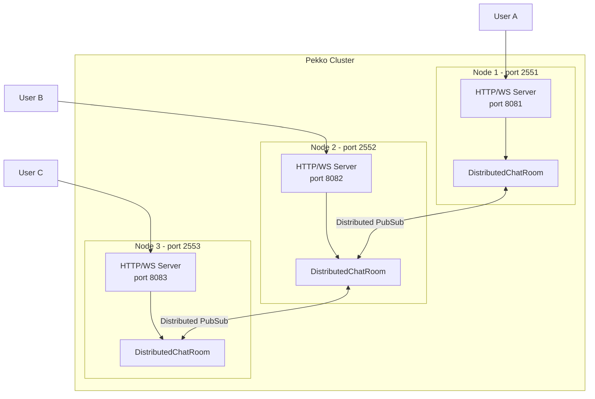

# WebSocket Cluster 모듈

Pekko Cluster와 WebSocket을 결합한 분산 채팅 예제입니다.

## 아키텍처



## 주요 컴포넌트

### DistributedChatRoom
- Pekko Distributed PubSub(Topic)을 사용하여 클러스터 전체에 메시지 브로드캐스트
- 각 노드는 로컬 사용자만 직접 관리
- 다른 노드의 사용자 정보는 Topic을 통해 동기화

### ClusterListener
- 클러스터 멤버 이벤트 모니터링
- 노드 가입/탈퇴/도달성 변경 로깅

### WebSocketClusterRoutes
- Pekko HTTP를 사용한 WebSocket 엔드포인트
- REST API로 사용자 목록 및 클러스터 정보 제공

## 실행 방법

### 노드 1 (Seed Node)
```bash
./gradlew :websocket-cluster:run -PCLUSTER_PORT=2551 -PHTTP_PORT=8081
```

### 노드 2
```bash
./gradlew :websocket-cluster:run -PCLUSTER_PORT=2552 -PHTTP_PORT=8082
```

### 노드 3
```bash
./gradlew :websocket-cluster:run -PCLUSTER_PORT=2553 -PHTTP_PORT=8083
```

## API 엔드포인트

- `ws://localhost:{port}/ws/chat?username={name}` - WebSocket 채팅
- `GET /api/users` - 접속 사용자 목록
- `GET /api/cluster-info` - 클러스터 노드 정보
- `GET /` - 채팅 클라이언트 HTML 페이지

## 테스트

```bash
./gradlew :websocket-cluster:test
```

## 메시지 형식

### 채팅 메시지 (수신)
```json
{
  "type": "chat",
  "username": "alice",
  "message": "안녕하세요!",
  "nodeAddress": "pekko://WebSocketClusterSystem@127.0.0.1:2551",
  "timestamp": 1703500000000
}
```

### 시스템 메시지 (수신)
```json
{
  "type": "system",
  "message": "alice 님이 채팅에 참여했습니다",
  "timestamp": 1703500000000
}
```

### 메시지 전송
WebSocket으로 텍스트 메시지를 그대로 전송하면 됩니다.

