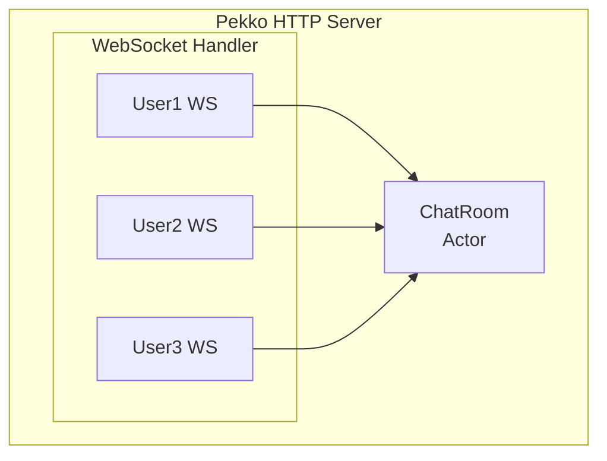

# WebSocket 모듈 (Pure Pekko HTTP)

이 모듈은 순수 Pekko HTTP와 Actor를 사용한 WebSocket 구현을 보여줍니다.

## 기능

- **채팅방**: WebSocket을 사용한 실시간 채팅
- **Actor 기반 세션 관리**: Actor 메시징을 통한 사용자 세션 관리
- **메시지 브로드캐스트**: 연결된 모든 사용자에게 메시지 전송
- **사용자 접속 상태**: 입장/퇴장 알림

## 아키텍처



## 실행 방법

```bash
./gradlew :websocket:run
```

서버 시작 위치:

- HTTP: http://localhost:8080/
- WebSocket: ws://localhost:8080/ws/chat?username=<name>

## API

### WebSocket 엔드포인트

`ws://localhost:8080/ws/chat?username=<name>` 으로 연결

**수신 메시지** (서버에서):

```json
// 채팅 메시지
{"type":"chat","username":"alice","message":"안녕하세요!","timestamp":1703123456789}

// 시스템 메시지
{"type":"system","message":"bob님이 채팅에 참여했습니다","timestamp":1703123456789}

// 사용자 목록
{"type":"users","users":["alice","bob"]}
```

**송신 메시지** (서버로):
일반 텍스트 메시지를 그대로 전송합니다.

### REST API

| Method | Endpoint     | 설명            |
|--------|--------------|---------------|
| GET    | `/api/users` | 온라인 사용자 목록 조회 |

## wscat으로 테스트

```bash
# wscat 설치
npm install -g wscat

# 사용자로 연결
wscat -c "ws://localhost:8080/ws/chat?username=alice"

# 메시지를 입력하고 Enter를 눌러 전송
```

## 브라우저로 테스트

http://localhost:8080/ 에서 내장 채팅 UI를 사용할 수 있습니다.
