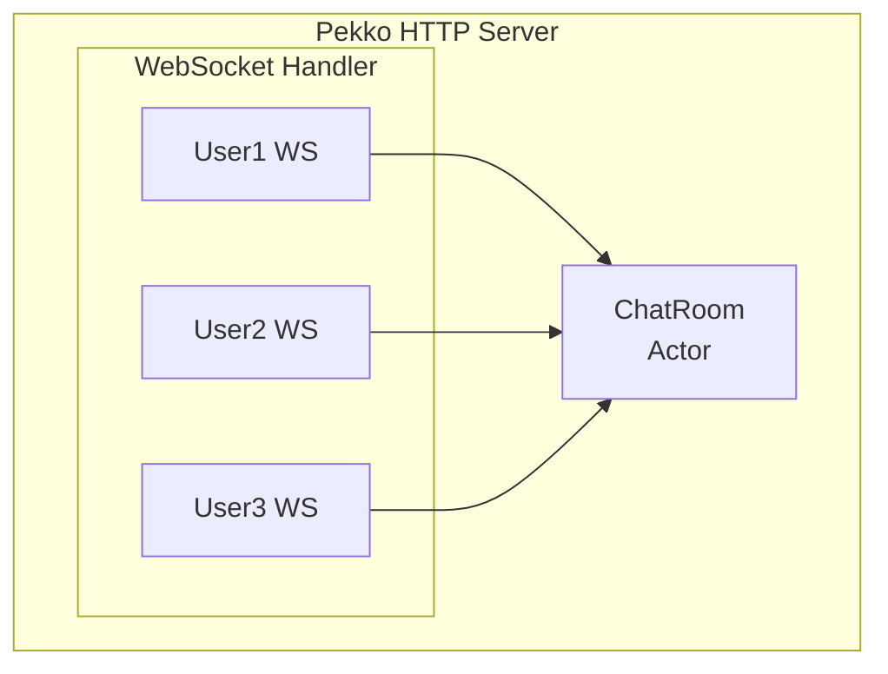

# WebSocket Module (Pure Pekko HTTP)

This module demonstrates WebSocket implementation using pure Pekko HTTP and Actors.

## Features

- **Chat Room**: Real-time chat using WebSocket
- **Actor-based Session Management**: Each user session is managed via actor messaging
- **Message Broadcasting**: Messages are broadcast to all connected users
- **User Presence**: Join/leave notifications

## Architecture



## Running

```bash
./gradlew :websocket:run
```

Server starts at:
- HTTP: http://localhost:8080/
- WebSocket: ws://localhost:8080/ws/chat?username=<name>

## API

### WebSocket Endpoint

Connect to `ws://localhost:8080/ws/chat?username=<name>`

**Incoming Messages** (from server):
```json
// Chat message
{"type":"chat","username":"alice","message":"Hello!","timestamp":1703123456789}

// System message
{"type":"system","message":"bob joined the chat","timestamp":1703123456789}

// User list
{"type":"users","users":["alice","bob"]}
```

**Outgoing Messages** (to server):
Plain text messages are sent as-is.

### REST API

| Method | Endpoint     | Description              |
|--------|--------------|--------------------------|
| GET    | `/api/users` | Get list of online users |

## Testing with wscat

```bash
# Install wscat
npm install -g wscat

# Connect as user
wscat -c "ws://localhost:8080/ws/chat?username=alice"

# Send messages by typing and pressing Enter
```

## Testing with Browser

Open http://localhost:8080/ in your browser to use the built-in chat UI.
